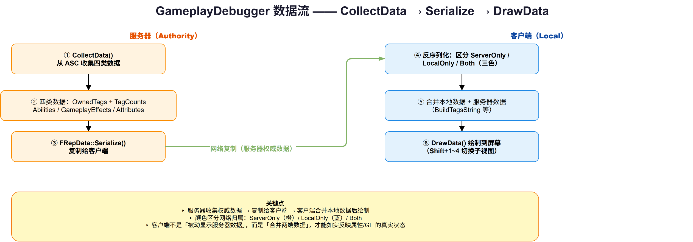
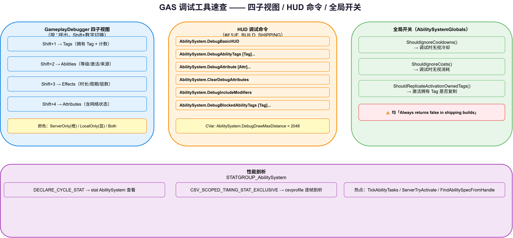

# 14 | Debug & Optimization — 调试与优化

> **本篇**：GAS 的调试与优化 —— `GameplayDebugger` 的 GAS 集成、`ShowDebug`/HUD 调试命令、`AbilitySystemGlobals` 全局开关与性能剖析手段

> **系列**: 《Inside GAS》— UE5 GameplayAbilitySystem 源码深度分析  
> **难度**: 🔴 源码  
> **字数**: ~5800  
> **前置**: 02-ASC、05/06-GameplayEffect  
> **源码路径**: `Engine/Plugins/Runtime/GameplayAbilities/Source/GameplayAbilities/Public/GameplayDebuggerCategory_Abilities.h`

---

> **系列导航**
> 
> | 阶段 | 篇章 | 内容 | 状态 |
> |------|------|------|------|
> | 🟢 基础 | 01 | GAS 总览与核心架构 | ✅ |
> | | 02 | ASC — 核心调度器 | ✅ |
> | | 03 | GameplayTags — 通用语言 | ✅ |
> | | 04 | AttributeSet — 属性定义与复制 | ✅ |
> | 🔵 核心 | 05 | GameplayEffect — 效果与计算 (上) | ✅ |
> | | 06 | GameplayEffect — 效果与计算 (下) | ✅ |
> | | 07 | GameplayAbility — 技能激活与核心框架 (上) | ✅ |
> | | 08 | GameplayAbility — Task/输入/预测 (下) | ✅ |
> | | 09 | GameplayCue — 表现层触发机制 | ✅ |
> | 🔴 高级 | 10 | Prediction — 预测与回滚 | ✅ |
> | | 11 | GE Components — 组件化架构演进 | ✅ |
> | | 12 | Network & Serial — 网络序列化 | ✅ |
> | | 13 | Targeting — 瞄准系统 | ✅ |
> | | **14** | **Debug & Optimization — 调试与优化** | ✅ |
> | | 15 | 终篇回顾 — 全景复习 | 📝 |

---

## 一、问题驱动：为什么你的技能"没生效"，你该看哪？

GAS 是一套高度解耦的系统——技能激活走九道检查、GE 应用走组件分发、属性变化走聚合器重算、表现走 Cue 路由。这套解耦带来灵活性的同时，也带来一个**切肤之痛**：

> 当"技能没生效"时，你根本不知道是卡在了哪一层。

是 `CanActivateAbility` 的 Tag 检查没过？是冷却没好？是 GE 被免疫组件挡了？是预测键没追上？还是表现层的 Cue 根本没路由到？这些层之间彼此透明，单靠打断点要一层层追，效率极低。

所以 GAS 提供了一整套**专为"快速定位卡点"设计的调试工具**，本篇拆开它们：

1. **GameplayDebugger 集成**——按 `'` 键呼出，Shift+数字键切换 Tag/技能/效果/属性四个视图；
2. **HUD 调试命令**——`AbilitySystem.Debug*` 系列控制台命令，画在屏幕上；
3. **全局调试开关**——`AbilitySystemGlobals` 里那些"只在非 Shipping 生效"的快捷开关；
4. **性能剖析**——`STATGROUP_AbilitySystem` 的周期统计与 CSV 剖析。

---

## 二、概念速览：三类调试工具的分工

| 工具 | 形态 | 适用场景 | 成本 |
|------|------|---------|------|
| GameplayDebugger | 屏幕 HUD + 键位切换 | 运行时"看"某个角色的完整 GAS 状态 | 低（按 `'` 呼出） |
| HUD 调试命令 | 控制台命令 | 只关注某一项（Tag/属性）时，画在目标身上 | 低（敲命令） |
| 全局开关 | `AbilitySystemGlobals` 配置 | 调试"冷却/消耗/复制"这类全局行为 | 零（改配置） |

**一个贯穿始终的观察**：这些工具**几乎全部包在 `#if !UE_BUILD_SHIPPING` 或 `Always returns false in shipping builds` 里**。这不是巧合——调试工具本身有性能开销，绝不允许泄漏到正式发布的包体里。GAS 把"调试能力"和"运行时性能"严格隔离，是它性能观的一个缩影。

---

## 三、GameplayDebugger 集成：按 `'` 键的完整状态面板

### 3.1 它是什么

`FGameplayDebuggerCategory_Abilities`（`GameplayDebuggerCategory_Abilities.h:25`）是 GameplayDebugger 的一个**分类（Category）**：

```cpp
class GAMEPLAYABILITIES_API FGameplayDebuggerCategory_Abilities : public FGameplayDebuggerCategory
{
    // ...
};
```

它继承 UE 引擎通用的 `FGameplayDebuggerCategory` 框架，实现了三个标准回调：

| 回调 | 职责 |
|------|------|
| `CollectData` | 从 ASC 收集四类数据（Tag/技能/效果/属性） |
| `DrawData` | 把数据画到屏幕上 |
| `NetSerialize`（`FRepData::Serialize`） | 服务器数据复制给客户端 |

### 3.2 四个子视图：Shift + 数字键

构造函数里绑定了四个键位（`GameplayDebuggerCategory_Abilities.cpp:54-57`）：

```cpp
BindKeyPress(KeyNameOne, FGameplayDebuggerInputModifier::Shift, this, &...::OnShowGameplayTagsToggle, ...);      // Shift+1
BindKeyPress(KeyNameTwo, FGameplayDebuggerInputModifier::Shift, this, &...::OnShowGameplayAbilitiesToggle, ...);  // Shift+2
BindKeyPress(KeyNameThree, FGameplayDebuggerInputModifier::Shift, this, &...::OnShowGameplayEffectsToggle, ...);   // Shift+3
BindKeyPress(KeyNameFour, FGameplayDebuggerInputModifier::Shift, this, &...::OnShowGameplayAttributesToggle, ...); // Shift+4
```

四个子视图对应 GAS 的四大核心数据：

| 键位 | 视图 | 内容 |
|------|------|------|
| Shift+1 | Tags | 拥有的 GameplayTag + 每个 Tag 的计数 |
| Shift+2 | Abilities | 技能列表（等级、是否激活、来源） |
| Shift+3 | Effects | 激活的 GE 列表（时长、周期、层数、网络状态） |
| Shift+4 | Attributes | 属性值（含网络状态检测） |

### 3.3 CollectData：四类数据的收集

`CollectData`（`GameplayDebuggerCategory_Abilities.cpp:146-185`）是核心，它依次收集：

```cpp
AbilityComp->GetOwnedGameplayTags(DataPack.OwnedTags);   // 1. Tag + 计数
// 2. 技能：GetActivatableAbilities()，取 Name/Source/Level/bIsActive
// 3. 效果：CollectEffectsData()，取 ReplicationID/Duration/Period/Stacks/Level
// 4. 属性：CollectAttributeData()，含网络状态检测
```

其中 `CollectEffectsData`（187-212）收集每个 GE 的 `ReplicationID`、`bIsInhibited`、`Duration`、`Period`、`Stacks`、`Level`、`Context`，并记录 `NetworkStatus`（`ServerOnly` 还是 `LocalOnly`）。这和第 05/06 篇讲的 `FActiveGameplayEffect` 字段一一对应——**调试面板就是"运行时可视化"的 GE 列表**。

### 3.4 网络状态的颜色区分：ServerOnly vs LocalOnly

`CollectAttributeData`（214-265）里有一段**特别值得注意**的逻辑——它花了大量代码去检测"这个属性到底复制不复制"：

```cpp
// 检测 ASC 是否复制（bASCReplicates）
const bool bASCReplicates = (NetCondition != COND_Never) && AbilityComp->IsSupportedForNetworking() && ...;
// 还要处理 COND_NetGroup 的特殊情况
const TStaticBitArray<COND_Max> ConditionMap = UE::Net::BuildConditionMapFromRepFlags(RepFlags);
bASCReplicates = UActorChannel::CanSubObjectReplicateToClient(...);
```

为什么 `COND_NetGroup` 需要这么多额外处理？因为它的复制条件不是简单的"是/否"，而是**动态的组成员关系**。`CoreNetTypes.h:34` 对它的定义是：

> This subobject will replicate to connections that are part of the same group the subobject is registered to. Not usable on properties.

也就是说，`COND_NetGroup` 只用于**子对象**复制，且"是否复制给某条连接"取决于"连接和子对象是否在同一个 netcondition group（一个 `FName`）里"——这是运行时由 `FNetConditionGroupManager` 动态维护的，无法在编译期静态判断。所以调试工具不能简单用 `NetCondition != COND_Never` 下结论，而必须调 `CanSubObjectReplicateToClient` 让网络层实时算出"这条连接到底收不收得到"。

这段代码的目的，是在调试面板里**用颜色区分属性的网络状态**（`GameplayDebuggerCategory_Abilities.h:55-66` 的 `FGameplayAttributeDebug`）：

- **ServerOnly** 属性（服务器才有权威值）；
- **LocalOnly** 属性（只在本端有效）；
- **Both**（两端都有）。

这直接呼应了第 12 篇的网络复制——调试工具要如实反映"这个属性在网络上是什么状态"，否则开发者会被"客户端明明改了值，服务器却看不到"这类问题搞懵。



*图：GameplayDebugger 数据流 —— 服务器 CollectData 收集四类数据 → FRepData.Serialize 复制给客户端 → 客户端反序列化（区分 ServerOnly/LocalOnly/Both 三色）→ 合并本地数据 → DrawData 绘制到屏幕*

---

## 四、HUD 调试命令：AbilitySystem.Debug*

除了 GameplayDebugger，GAS 还提供了一组**控制台命令**，直接在目标 Actor 身上画调试信息。它们全部定义在 `AbilitySystemDebugHUD.cpp:615-649`，且**全部包在 `#if !UE_BUILD_SHIPPING`**：

| 命令 | 作用 |
|------|------|
| `AbilitySystem.DebugBasicHUD` | 切换本地玩家的基础 HUD |
| `AbilitySystem.DebugAbilityTags [Tag]...` | 在 ASC 身上画拥有的 Tag（可指定） |
| `AbilitySystem.DebugAttribute [Attr]...` | 画指定属性值 |
| `AbilitySystem.ClearDebugAttributes` | 停止画属性 |
| `AbilitySystem.DebugIncludeModifiers` | 属性旁是否显示 modifier 明细 |
| `AbilitySystem.DebugBlockedAbilityTags [Tag]...` | 画被阻挡的技能 Tag |

还有几个 CVar（`AbilitySystemDebugHUD.cpp:25-31`）：

```cpp
static float DebugDrawMaxDistance = 2048.f;
static FAutoConsoleVariableRef CVarDebugDrawMaxDistance(
    TEXT("AbilitySystem.DebugDrawMaxDistance"),
    DebugDrawMaxDistance,
    TEXT("Set the maximum camera distance allowed for Debug Drawing by the Ability System."));
```

`DebugDrawMaxDistance` 限制调试绘制的最大相机距离——**超过 2048 单位的 Actor 不画**，避免远景一大堆调试信息淹没屏幕。

**和 GameplayDebugger 的区别**：HUD 命令是"**钉在 Actor 身上**"的——它跟随目标移动，适合"盯着某个具体目标看它的 Tag/属性变化"；而 GameplayDebugger 是"**全局面板**"——固定位置显示当前选中对象的完整状态。

---

## 五、全局调试开关：AbilitySystemGlobals

### 5.1 那些"只在非 Shipping 生效"的开关

`AbilitySystemGlobals`（GAS 的全局单例配置）里有几个**专为调试**设计的开关（`AbilitySystemGlobals.h:163-168`）：

```cpp
/** Returns true if ability cooldowns are ignored, returns false otherwise. Always returns false in shipping builds. */
UE_API bool ShouldIgnoreCooldowns() const;

/** Returns true if ability costs are ignored, returns false otherwise. Always returns false in shipping builds. */
UE_API bool ShouldIgnoreCosts() const;
```

这两个开关的用途一目了然——**调试技能时不想被冷却/消耗卡住**，就把它们置 `true`，让所有技能"无冷却、无消耗"地随便放。

注释里反复强调的 "Always returns false in shipping builds" 值得注意：**这些开关的"开"状态在正式包体里被强制关闭**。这是 GAS 性能观/安全观的体现——调试便利绝不能成为正式版的隐患。

### 5.2 ShouldReplicateActivationOwnedTags

另一个相关开关（`AbilitySystemGlobals.h:106-107`）：

```cpp
/** Returns true if tags granted to owners from ability activations should be replicated */
UE_API bool ShouldReplicateActivationOwnedTags() const;
```

这控制"技能激活时授予拥有者的 Tag 是否复制"。默认关闭（因为激活拥有的 Tag 通常是本地预测的），开启会增加复制流量。这是一个"调试 vs 性能"的典型权衡点——**默认省流量，但如果你发现某 Tag 在客户端缺失，可能就是这里没开**。

---

## 六、性能剖析：STATGROUP_AbilitySystem

### 6.1 周期统计：DECLARE_CYCLE_STAT

GAS 在关键路径上埋了大量周期统计（`AbilitySystemComponent_Abilities.cpp:44-46`）：

```cpp
DECLARE_CYCLE_STAT(TEXT("AbilitySystemComp ServerTryActivate"), STAT_AbilitySystemComp_ServerTryActivate, STATGROUP_AbilitySystem);
DECLARE_CYCLE_STAT(TEXT("AbilitySystemComp ServerEndAbility"), STAT_AbilitySystemComp_ServerEndAbility, STATGROUP_AbilitySystem);
```

然后在对应函数里用 `SCOPE_CYCLE_COUNTER` 包裹（如 `AbilitySystemComponent_Abilities.cpp:2102`）：

```cpp
SCOPE_CYCLE_COUNTER(STAT_AbilitySystemComp_ServerTryActivate);
SCOPE_CYCLE_UOBJECT(Ability, AbilityToActivate);
```

这些统计统一归入 **`STATGROUP_AbilitySystem`** 组，可以用 `stat AbilitySystem` 命令在运行时查看，或在 Unreal Insights 里剖析。

### 6.2 CSV 剖析：CSV_SCOPED_TIMING_STAT_EXCLUSIVE

除了周期统计，关键路径还埋了 CSV 标记（`AbilitySystemComponent_Abilities.cpp:142`）：

```cpp
SCOPE_CYCLE_COUNTER(STAT_TickAbilityTasks);
CSV_SCOPED_TIMING_STAT_EXCLUSIVE(AbilityTasks);
```

`CSV_SCOPED_TIMING_STAT_EXCLUSIVE` 会把这段代码的耗时写入 CSV 文件，供 `csvprofile` 等工具做**逐帧的精确剖析**。这比 `stat` 更细——能定位到"第 372 帧的 AbilityTasks tick 花了 0.3ms"这种粒度。

### 6.3 关注点：哪些是热点

结合前几篇的分析，GAS 的性能热点通常集中在：

| 热点 | 原因 | 剖析手段 |
|------|------|---------|
| **TickAbilityTasks** | 每帧 tick 所有激活的 AbilityTask | `stat AbilitySystem` / CSV |
| **ServerTryActivate** | 服务器权威检查链 | `STAT_AbilitySystemComp_ServerTryActivate` |
| **句柄查 Spec** | 激活链路里高频的 Handle→Spec 查找 | `STAT_FindAbilitySpecFromHandle` |
| **GE 复制 diff** | 服务器每帧对 GE 列表做 FastArray diff | 第 12 篇的 `MarkArrayDirty` |

Epic 埋的这些统计点，本身就是一份"**性能优化地图**"——告诉你哪些地方值得盯。



*图：GAS 调试工具速查 —— 四子视图（Shift+1~4 键位）+ HUD 命令（AbilitySystem.Debug* 系列）+ 全局开关（ShouldIgnoreCooldowns/Costs 等，均 Shipping 强制 false）+ 性能剖析（stat AbilitySystem / CSV）*

---

## 七、设计思考：调试工具的三个"克制"

### 7.1 克制一：调试能力与运行时严格隔离

贯穿本篇的一条暗线是：**所有调试工具都被 `#if !UE_BUILD_SHIPPING` 或 "Always false in shipping" 严格隔离**。

这不是简单的"生产环境不需要调试"——而是更深的设计判断：**调试工具本身有成本**（额外的数据收集、屏幕绘制、网络复制），这些成本在开发期可以接受，在正式版里就是纯浪费。所以 GAS 把"调试"和"运行"做成两个**编译期分离的世界**。

### 7.2 克制二：调试面板如实反映"网络状态"

`CollectAttributeData` 花大量代码检测 `bASCReplicates`、处理 `COND_NetGroup`，然后**用颜色区分 ServerOnly/LocalOnly**。这背后是一个朴素的判断：

> 一个不能如实反映"这个值在网络上是什么状态"的调试工具，会误导开发者。

如果调试面板把"客户端本地预测值"和"服务器权威值"混在一起显示，开发者就会被"明明显示血是 100，怎么服务器算出来是 80"这种问题折磨。GAS 的调试工具选择**如实标注网络归属**，哪怕这需要额外的检测代码。

### 7.3 克制三：统计点本身就是优化地图

`DECLARE_CYCLE_STAT` / `CSV_SCOPED_TIMING_STAT_EXCLUSIVE` 的埋点位置，不是随便挑的——它们集中在 GAS 的**已知热点**上（ServerTryActivate、TickAbilityTasks、FindAbilitySpecFromHandle）。

这体现了一种"**把优化经验固化到代码里**"的思路：Epic 踩过这些坑、知道哪里慢，就把统计点埋在那里，让后来者**不需要重新发现一遍**。这和前面几篇（Prediction 的"未解决问题"、TargetActor 的"不高效"）是一脉相承的——**GAS 的源码不仅教你用，还通过注释和埋点告诉你"哪里要注意"**。

---

## 八、总结

本篇拆解了 GAS 的调试与优化：

| 主题 | 关键点 |
|------|--------|
| **GameplayDebugger** | `FGameplayDebuggerCategory_Abilities`，四子视图（Shift+1~4），`CollectData`/`DrawData`/`NetSerialize` |
| **网络状态区分** | `CollectAttributeData` 检测 `bASCReplicates`，用颜色区分 ServerOnly/LocalOnly |
| **HUD 命令** | `AbilitySystem.Debug*` 系列，全部 `#if !UE_BUILD_SHIPPING` |
| **CVar** | `AbilitySystem.DebugDrawMaxDistance`（2048.f）限制绘制距离 |
| **全局开关** | `ShouldIgnoreCooldowns`/`ShouldIgnoreCosts`（Shipping 强制 false）、`ShouldReplicateActivationOwnedTags` |
| **性能剖析** | `STATGROUP_AbilitySystem` + `DECLARE_CYCLE_STAT` + `CSV_SCOPED_TIMING_STAT_EXCLUSIVE` |

下一篇是系列终篇——全景回顾 GAS 的完整架构，把 01~14 篇的知识串成一张总图。

**上一篇**：[13 | Targeting — 瞄准系统](../13-Targeting/13-Targeting文章.md)

**下一篇**：[15 | 终篇回顾 — 全景复习](../15-Retrospective/15-Retrospective文章.md) —— 串联 GAS 的完整架构、核心设计哲学与学习路线图。

---

*本文基于 UE 5.8 源码分析。系列文章会继续按模块拆解，从基础到高级，从 API 到设计哲学。*
