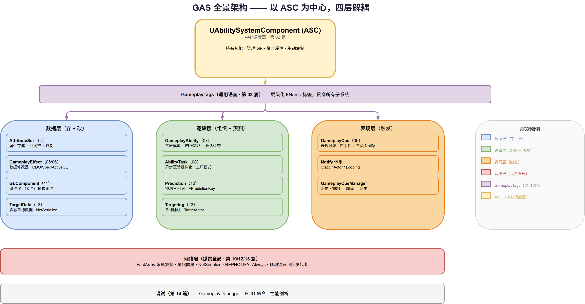

# 15 | 终篇回顾 — 全景复习

> **本篇**：系列终篇 —— 串联 GAS 的完整架构、提炼贯穿全系列的核心设计哲学、用设计模式视角重新梳理，并给出学习路线图

> **系列**: 《Inside GAS》— UE5 GameplayAbilitySystem 源码深度分析  
> **难度**: 🔴 源码（回顾）  
> **字数**: ~6000  
> **前置**: 全系列 01~14 篇  
> **源码路径**: `Engine/Plugins/Runtime/GameplayAbilities/`

---

> **系列导航**
> 
> | 阶段 | 篇章 | 内容 | 状态 |
> |------|------|------|------|
> | 🟢 基础 | 01 | GAS 总览与核心架构 | ✅ |
> | | 02 | ASC — 核心调度器 | ✅ |
> | | 03 | GameplayTags — 通用语言 | ✅ |
> | | 04 | AttributeSet — 属性定义与复制 | ✅ |
> | 🔵 核心 | 05 | GameplayEffect — 效果与计算 (上) | ✅ |
> | | 06 | GameplayEffect — 效果与计算 (下) | ✅ |
> | | 07 | GameplayAbility — 技能激活与核心框架 (上) | ✅ |
> | | 08 | GameplayAbility — Task/输入/预测 (下) | ✅ |
> | | 09 | GameplayCue — 表现层触发机制 | ✅ |
> | 🔴 高级 | 10 | Prediction — 预测与回滚 | ✅ |
> | | 11 | GE Components — 组件化架构演进 | ✅ |
> | | 12 | Network & Serial — 网络序列化 | ✅ |
> | | 13 | Targeting — 瞄准系统 | ✅ |
> | | 14 | Debug & Optimization — 调试与优化 | ✅ |
> | | **15** | **终篇回顾 — 全景复习** | ✅ |

---

## 一、写在最后之前：15 篇，我们走过了什么

第 01 篇开头，我们抛出了一个问题：假设你要做一个 RPG，属性、Buff、技能、同步这些逻辑怎么组织才不乱？Epic 的答案是 GAS——一个"把属性、效果、技能、表现彻底解耦"的框架。

15 篇下来，我们从那张"七大子系统"全景图出发，逐个钻进了每个子系统的源码，看清楚了它们**各自怎么工作**，也看到了它们**如何咬合成一个整体**。现在，是时候退后一步，回答那个最初的问题：**这套东西，到底高明在哪？**

这篇终篇做三件事：

1. **回顾**——把 14 篇的知识串成一张"全景脑图"，让你看清它们的位置关系；
2. **提炼**——找出贯穿全系列的**核心设计哲学**（它们反复出现，是理解 GAS 的钥匙）；
3. **重述**——用**设计模式**的视角重新审视 GAS，让你在"另一个坐标系"里巩固理解。

---

## 二、全景回顾：14 篇的完整知识地图

### 2.1 一句话串起整个系列

> **GAS 以 ASC 为中心调度器，用 GameplayTags 做通用语言，用 AttributeSet 存数据，用 GameplayEffect 改数据，用 GameplayAbility 组织逻辑，用 GameplayCue 做表现，用 Prediction 优化手感，用 Network Replication 贯穿所有——而这些子系统又被"组件化 + 多态 + 预测"三条主线反复重构。**

### 2.2 四大层次：14 篇的递进结构

| 层次 | 篇章 | 核心问题 | 一句话答案 |
|------|------|---------|-----------|
| 🟢 **基础** | 01~04 | GAS 是什么、怎么组织 | 七大子系统 + 中心调度器 |
| 🔵 **核心** | 05~09 | 数据怎么改、逻辑怎么跑 | GE 改属性、GA 组织逻辑、Cue 做表现 |
| 🔴 **高级** | 10~13 | 网络怎么同步、架构怎么演进 | 预测、组件化、序列化、瞄准 |
| 🔴 **收尾** | 14~15 | 怎么调试、怎么看全景 | 调试工具 + 全景回顾 |

### 2.3 各篇一句话速览

| 篇 | 标题 | 一句话核心 |
|----|------|-----------|
| 01 | GAS 总览与核心架构 | 七大子系统 + "解耦"的总纲 |
| 02 | ASC：核心调度器 | 一切的中心，持有技能、管理 GE、聚合属性 |
| 03 | GameplayTags：通用语言 | 层级化的 `FName` 标签，跨子系统通信的"语言" |
| 04 | AttributeSet：属性定义 | 属性存储 + 回调链（Pre/Post）+ 网络复制 |
| 05 | GE：数据结构与配置 | CDO/Spec/ActiveGE 三层 + Duration/Modifier/Tags |
| 06 | GE：效果与计算 | 执行流程 + 属性聚合 + modifier 计算 |
| 07 | GA：激活与核心框架 | 三层模型 + 四维策略 + 九道激活检查 + Commit/End |
| 08 | GA：Task/输入/预测 | AbilityTask 工厂 + 输入路由 + 瞄准 |
| 09 | GameplayCue：表现层 | Tag 路由 + 四事件 + 三类 Notify |
| 10 | Prediction：预测与回滚 | FPredictionKey 生命周期 + Undo/Redo + 依赖链 |
| 11 | GE Components：组件化 | 巨型类 → 可插拔组件 + 版本演进 |
| 12 | Network & Serial | FastArray 增量复制 + 量化向量 |
| 13 | Targeting：瞄准系统 | TargetActor + TargetData 多态序列化 |
| 14 | Debug & Optimization | GameplayDebugger + HUD 命令 + 性能剖析 |

### 2.4 全景架构图

*图：GAS 全景架构 —— 以 ASC 为中心调度器，GameplayTags 是贯穿所有子系统的通用语言，AttributeSet 是数据载体，GE 是数据修改器，GA 是逻辑执行单元，Cue 是表现层，Prediction 与 Network 纵贯全局，组件化贯穿 GE 的演进*

---

## 三、核心设计哲学：贯穿全系列的六条主线

回看这 14 篇，有几条设计思想**反复出现**，它们才是理解 GAS 的钥匙，比任何单个 API 都重要。

### 3.1 主线一：解耦 —— 一切设计的起点

从第 01 篇的"一句话定义"开始，"解耦"就是 GAS 的底色：

- **属性 vs 效果**：`AttributeSet` 只管"存什么"，`GameplayEffect` 只管"怎么改"，两者通过 `FGameplayAttribute` 这个"名字"松耦合；
- **逻辑 vs 表现**：GA 只喊"发生了 `GameplayCue.Fire.Impact`"，Cue 层自己决定播什么火花（第 09 篇）；
- **触发 vs 实现**：GE 用 Tag 引用 Cue，不直接引用粒子资产（第 05/09 篇）。

**解耦的代价是调试难**（第 14 篇开篇就点破"技能没生效，不知道卡在哪层"）。但 GAS 用"解耦 + 专用调试工具"的组合，把这个代价控制住了。

### 3.2 主线二：三层模型 —— 反复出现的结构

"三层"这个结构在 GAS 里出现了**至少三次**，不是巧合：

| 出现位置 | 三层 |
|---------|------|
| GE（第 05 篇） | CDO → Spec → ActiveGE |
| GA（第 07 篇） | Handle → Spec → Instance |
| TargetData（第 13 篇） | TargetActor → TargetData → Handle |

它们的共同逻辑是：**"模板（资产/定义）"、"运行时数据（实例）"、"引用（句柄）"三者分离**。模板是网络复制的最小单元，运行时数据是执行体，句柄是轻量门牌号。这个"三层分离"是 GAS 能同时做到"网络友好"和"内存高效"的结构基础。

### 3.3 主线三：网络优先 —— 设计从"怎么同步"倒推

GAS 最反直觉的一点是：**它的很多设计，是从"网络怎么同步"倒推出来的**。

- 属性用 `REPNOTIFY_Always`，因为预测时"值没变也要通知"（第 10/12 篇）；
- FastArray 用 ReplicationID 而非索引，因为"客户端预测元素会让索引错位"（第 12 篇）；
- TargetData 用 USTRUCT + NetSerialize 而非 UObject，因为"UObject 一到复制就卡住"（第 13 篇）；
- 预测键只回传给发起者，因为"别人的预测键是噪声"（第 10 篇）。

**网络不是 GAS 的"附加功能"，而是它的"第一公民"**。理解了这一点，很多"看起来奇怪"的设计就都通了。

### 3.4 主线四：组件化 —— 对抗"巨型类"的演进方向

第 11 篇详细讲了 GE 从"巨型类"到"组件化"的演进。但这不只是 GE 的事——**它是 GAS 整体应对"复杂度膨胀"的策略**：

- GE 拆成 18 个 `GEComponent`（第 11 篇）；
- AbilityTask 本身就是"把异步逻辑组件化"（第 08 篇）；
- Cue 的三类 Notify 是"把表现组件化"（第 09 篇）。

**组件化的代价是"共享实例不能存状态"**（第 11 篇坦诚指出），但换来的是"加功能不改引擎"的开放性。

### 3.5 主线五：多态 —— 处理"形态不确定"的武器

GAS 里凡是"形态不确定"的地方，都用多态：

- TargetData 的四个子类（第 13 篇）；
- Cue 的三类 Notify（第 09 篇）；
- GEComponent 的 18 个组件（第 11 篇）。

而多态在 GAS 里有个独特约束：**网络环境下，多态必须搭配"类型标识 + 自定义序列化"**。这就是第 13 篇讲的 `GetScriptStruct()` + `TargetDataStructCache` 的价值——**多态数据的跨网络传输，是整个系列技术难度最高的一个点**。

### 3.6 主线六：诚实的局限性 —— 最独特的"文档风格"

如果只挑一个 GAS 源码最打动人的特点，我会选这个：**它从不假装完美**。

- Prediction 头部注释列出"Triggered events 回滚不完整、Meta 属性不可预测、% GE 偏差"（第 10 篇）；
- TargetActor 自白"不高效、未充分测试"（第 13 篇）；
- GEComponent 承认"有些功能还没迁成组件，因为需要运行时状态"（第 11 篇）；
- `TARGETDATAHANDLE_SAFE_NET_SERIALIZE` 标注"未验证"（第 13 篇）。

这六条主线，就是 GAS 的"设计哲学"。记住它们，比记住任何单个 API 都有用。

---

## 四、用设计模式重新审视 GAS

换个坐标系，用经典的**设计模式**来重新标注 GAS 的各个子系统。这不是贴标签，而是帮你把 GAS 的知识和更通用的软件工程知识**打通**（Milo Yip 式的跨领域串联）。

### 4.1 观察者模式（Observer）：属性回调 + 委托

- `AttributeSet` 的 `PreAttributeChange`/`PostGameplayEffectExecute`（第 04 篇）；
- `FPredictionKey` 的 `NewRejectedDelegate`/`NewCaughtUpDelegate`（第 10 篇）；
- Cue 的 `FAbilityTargetData` 委托（第 09/13 篇）。

GAS 用"委托"这个 C++ 世界的观察者实现，到处做"事件 → 回调"的解耦。

### 4.2 工厂模式（Factory）：AbilityTask

第 08 篇讲的 AbilityTask，是**工厂模式 + 模板方法**的教科书级应用：

- `NewAbilityTask<T>()` 是工厂（统一 `NewObject` + `InitTask`）；
- 每个 Task 的静态 `WaitDelay`/`WaitForOverlap` 是具体工厂；
- `ReadyForActivation()` → `Activate()` 是模板方法（基类定义骨架，子类填充）。

### 4.3 策略模式（Strategy）：四维策略枚举

第 07 篇讲的 GA 四维策略（NetExecution/Instancing/Replication/NetSecurity），本质是**策略模式**——把"技能怎么执行/实例化/复制/终止"这些可变行为，抽象成可配置的枚举，让同一个 `UGameplayAbility` 类适应不同场景。

### 4.4 组件模式（Component）：GEComponent

第 11 篇的 GEComponent 是**组件模式**的极致——不是 Unity 式"对象挂组件"，而是"数据资产组合行为模块"。它同时实现了：

- **开放封闭原则**（加功能不改引擎）；
- **单一职责原则**（每个组件只做一件事）；
- **依赖倒置**（GE 依赖抽象回调时机，不依赖具体功能）。

### 4.5 默认对象共享：CDO

第 05/07 篇反复提到的 **CDO（Class Default Object）**，是"默认实例被所有对象共享"的模式——它**近似享元模式（Flyweight）**，但动机更接近"配置的单一来源"（Single Source of Truth），而非经典的"共享不可变对象以节省内存"。GE 的 CDO、GA 的 CDO，都是"配置只存一份，实例按需派生"。

### 4.6 模板方法（Template Method）：激活链路

第 07 篇的 `CanActivateAbility` → `ActivateAbility` → `CommitAbility` → `EndAbility`，是**模板方法模式**——基类定义固定的调用骨架（九道检查、提交、清理），蓝图/子类只填充具体逻辑（`K2_ActivateAbility`、`K2_CommitExecute`）。

### 4.7 一句话总结

> **GAS 是"观察者 + 工厂 + 策略 + 组件 + 享元 + 模板方法"六大模式的组合体，而贯穿它们的是同一个目标——在"网络同步"这个硬约束下，实现最大限度的"解耦"。**

---

## 五、学习路线图：如果你要重新学一遍

作为系列收尾，给出一条"如果重来"的学习路线。这不是复述目录，而是**按"依赖关系"和"认知难度"重新排序**：

### 5.1 第一遍：建立坐标系（读 01、03）

先读 01（全景图）和 03（GameplayTags），因为 **Tags 是理解后面一切的"语言"**——GE 的 Tag 要求、GA 的 Tag 检查、Cue 的 Tag 路由，全都建立在这个语言之上。

### 5.2 第二遍：理解"数据怎么改"（读 04、05、06）

属性（04）→ GE 结构（05）→ GE 计算（06），这是 GAS 的"数据流主干"。**属性聚合（06）是理解后续预测（10）的前提**。

### 5.3 第三遍：理解"逻辑怎么跑"（读 07、08）

GA 激活（07）→ Task（08），这是"逻辑流主干"。**Task 是理解瞄准（13）和预测（08/10）的前提**。

### 5.4 第四遍：理解"网络怎么同步"（读 10、12、13）

预测（10）→ 序列化（12）→ 瞄准（13），这是 GAS 的"高级区"。**进阶读者建议先读 12（FastArray）再读 10（预测）**——注意这是与原系列编号不同的优化路径，因为预测的很多机制（如 `ItemMap.Reset()`）建立在序列化之上，先掌握序列化会让预测更好懂。

### 5.5 第五遍：理解"架构怎么演进"（读 11、09、14）

组件化（11）→ 表现层（09）→ 调试（14），这是"回头看"的一遍——用组件化的视角重新审视前面读过的 GE，用调试工具验证理解。

### 5.6 最终：回到源码

**这个系列的真正目标，不是让你"记住"这些 API，而是让你"敢读"源码**。GAS 的源码并不神秘——它只是"解耦 + 网络优先 + 诚实"这三条原则，在 128 个文件里的具体展开。

当你下次遇到"这个 GE 为什么没生效"，你能顺着 `CanApply` → 组件 → 回调一路追下去，而不是卡在"不知道从哪看"——**这个能力，才是这个系列真正想交给你的东西**。

---

## 六、总结：GAS 的"一图流"

最后，用一张"一图流"收束整个系列：

| 维度 | 核心答案 |
|------|---------|
| **是什么** | 把属性/效果/技能/表现解耦的游戏功能框架 |
| **中心** | ASC（调度器） |
| **语言** | GameplayTags（跨子系统通信） |
| **数据** | AttributeSet（存）+ GameplayEffect（改） |
| **逻辑** | GameplayAbility（组织） |
| **表现** | GameplayCue（触发） |
| **手感** | Prediction（预测 + 回滚） |
| **同步** | FastArray / NetSerialize（增量 + 量化） |
| **演进** | 组件化 / 多态（对抗复杂度） |
| **哲学** | 解耦 + 网络优先 + 诚实 |

**一个核心论断**（贯穿全系列的苏剑林式硬证据）：

> GAS 的一切"奇怪设计"，几乎都能追溯到同一个约束——**"网络同步"**。三层模型是为了复制、FastArray 的 ID 是为了复制、TargetData 的 USTRUCT 是为了复制、`REPNOTIFY_Always` 是为了预测。**理解了"网络优先"，你就理解了 GAS。**

---

*这个系列到这里就结束了。感谢你读到这里。如果这个系列帮你建立了对 GAS 的"全局坐标系"，让你敢于翻开那 128 个头文件——那么它的目的就达到了。*

*本文基于 UE 5.8 源码分析。系列文章已全部完成，从基础到高级，从 API 到设计哲学。*
