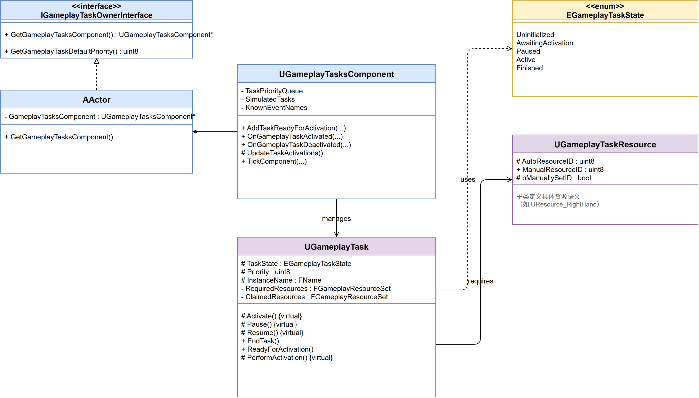
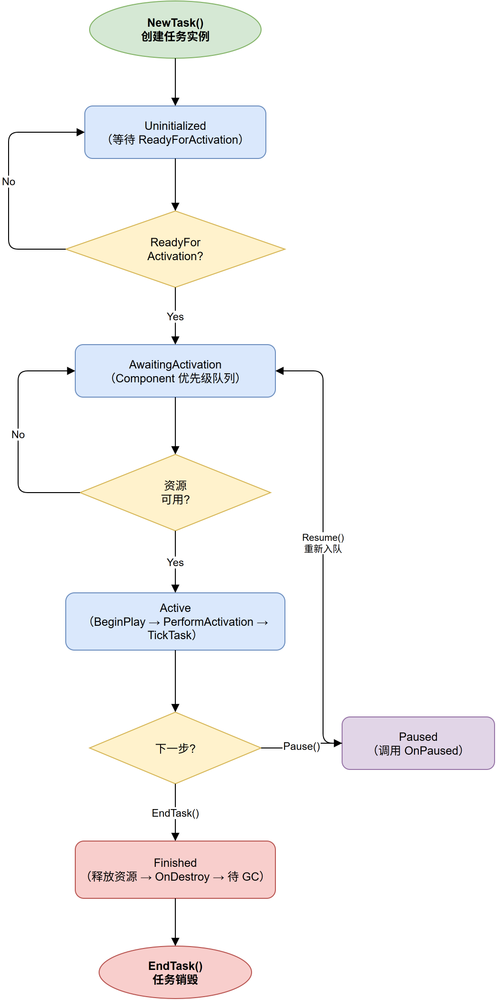

# GameplayTasks：一种被低估的异步任务调度框架

大家做 AI 的时候，第一反应是搬出行为树。这没错——行为树是 UE 官方推的标准方案，文档齐全，社区资料也丰富。

但如果你的需求不是"做一个会巡逻的敌人"，而是"做一个能被打断的引导技能"、"一个需要排队等待资源的动作"、"一个由玩法逻辑动态创建的小型异步任务"，行为树就开始显得笨重了。你得建 Task 节点、配黑板、调参数，最后可能只是为了让角色举一下手。

UE 其实提供了一个更轻量的答案：**GameplayTasks**。它藏在 `Engine/Source/Runtime/GameplayTasks` 下，和 GameplayAbilitySystem 同属 "高级玩法基础设施" 这个层级。很多人因为它没有独立的 UI 编辑器、也没有被官方示例大量宣传，就跳过了它。

这篇文章，我们来把它拆开看看。

---

## 一、先看全貌：几个核心角色

GameplayTasks 系统的设计非常克制——整个模块只有 4 个头文件和 4 个实现文件，加起来不到 3000 行 C++。但它的抽象层次很高，寥寥几个类就覆盖了任务调度的大部分场景。

### 1.1 一句话定义

| 类 | 职责 |
|---|---|
| **`UGameplayTask`** | 可异步执行、可暂停、可被打断的任务基类。每个任务是一个独立的 `UObject`。 |
| **`UGameplayTasksComponent`** | 任务管理者。负责创建、激活、暂停、终止任务，以及按优先级调度。挂载在 `AActor` 上。 |
| **`UGameplayTaskResource`** | 抽象资源。任务可以"声明" (claim) 某种资源，同类资源不能同时被多个任务占用。 |
| **`IGameplayTaskOwnerInterface`** | 任务所有者接口。`AActor` 实现它，表明 "我可以拥有任务"。 |

它们之间的关系用一张类图说明：



*图1：GameplayTasks 核心类关系 —— AActor 持有 Component，Component 管理 Task，Task 声明 Resource*

### 1.2 Owner 与 Component 的关系

这里有个容易混淆的点：**`UGameplayTasksComponent` 不是 Owner**，它只是 Owner 身上的一个"任务管理器"。

`AActor` 实现了 `IGameplayTaskOwnerInterface`，然后内部持有一个 `UGameplayTasksComponent`。调用路径是这样的：

```cpp
// 来自 Actor 自身（作为 Owner）
UClass* AActor::GetGameplayTaskOwnerDefaultComponent() const
{
    // 不需要显式创建 Component —— UE 反射系统在 Actor Spawn 时按此返回值自动挂载
    return UGameplayTasksComponent::StaticClass();
}
```

Owner 接口只暴露了一个 `GetGameplayTasksComponent()` 方法。这足够让任务反向找到自己的管理者了。

### 1.3 "不只是 AI 用的"

UI 动画队列、关卡加载流程、引导技能、甚至网络同步——凡是需要"创建→执行→可能暂停→可能被打断→结束"这个状态流转的东西，都可以用 GameplayTasks 建模。

---

## 二、任务状态机：五个状态的流转

`UGameplayTask` 的生命周期用一个 `EGameplayTaskState` 枚举表示：

```cpp
UENUM()
enum class EGameplayTaskState : uint8
{
    Uninitialized,         // 刚 new 出来，还未激活
    AwaitingActivation,    // Component 已接收，等待调度
    Active,                // 正在执行
    Finished,              // 正常完成
    Paused                 // 暂停中
};
```



*图2：UGameplayTask 五态状态机 —— Paused 和 Resume 均经过 AwaitingActivation 重新排队*

### 2.1 激活的起点：Activate()

每个任务的核心入口是 `Activate()`：

```cpp
void UGameplayTask::Activate()
{
    UGameplayTasksComponent* ComponentPtr = GetGameplayTasksComponent();
    if (ComponentPtr)
    {
        ComponentPtr->AddTaskReadyForActivation(*this);
    }
}
```

这里**不是直接激活，而是把自己丢给 Component 的等待队列**。真正的激活时机由 Component 决定——这就是优先级调度的起点。

### 2.2 BeginPlay / PerformActivation

当 Component 决定激活这个任务时，它会调用 `UGameplayTask::BeginPlay()`：

```cpp
void UGameplayTask::BeginPlay()
{
    bTickingTask = false;
    TaskState = EGameplayTaskState::Active;
    ActivateInTaskOwner();
    OnActivated(*this);
}
```

子类真正干活的地方在 `PerformActivation()` 里，而不是直接写在 `BeginPlay()` 里。GameplayTask 内部专门做了这个拆分，避免子类覆盖 `BeginPlay()` 时破坏状态管理。

### 2.3 暂停与继续

Pause 做的事很直接——切状态，通知子类：

```cpp
void UGameplayTask::Pause()
{
    if (TaskState == EGameplayTaskState::Active)
    {
        TaskState = EGameplayTaskState::Paused;
        OnPaused(*this); // 子类在这里停止 Tick、暂停计时器等
    }
}
```

Resume 则有一个关键设计：

```cpp
void UGameplayTask::Resume()
{
    if (TaskState == EGameplayTaskState::Paused)
    {
        TaskState = EGameplayTaskState::AwaitingActivation;
        UGameplayTasksComponent* Comp = GetGameplayTasksComponent();
        if (Comp)
        {
            Comp->AddTaskReadyForActivation(*this); // 重新排队，不是直接恢复
        }
    }
}
```

**Resume 不是直接恢复到 Active，而是回到 AwaitingActivation 重新排队**。为什么？因为暂停期间可能有更高优先级的任务进来了——如果直接恢复到 Active，就绕过了 Component 的调度，优先级形同虚设。

### 2.4 结束与清理

```cpp
void UGameplayTask::EndTask()
{
    TaskState = EGameplayTaskState::Finished;
    OnDestroy(); // 清理入口：释放资源、从 Component 中移除、广播事件
}

void UGameplayTask::OnDestroy()
{
    ReleaseClaimedResources();          // 归还所有独占资源，唤醒排队等待的任务
    RemoveFromComponentTaskList();       // 从 TaskPriorityQueue 中移除
    OnGameplayTaskDeactivated.Broadcast(*this); // 通知外部监听者
    MarkAsGarbage();                    // 不再需要了，交 GC
}
```

`EndTask()` 只有任务**自己**可以调用，或者 Component 强行终止它。任务永远不会莫名其妙地消失。

---

## 三、资源系统：最被低估的设计

### 3.0 问题场景

假设你有一个 AI 角色，同时开启了两个任务：
1. "举起武器"——需要占用右手
2. "挥手示意"——也需要占用右手

如果两个任务同时激活，右手应该怎么分配？这就是资源系统要解决的问题。

### 3.1 Resource 的定义

`UGameplayTaskResource` 本身是一个空的抽象类：

```cpp
UCLASS(Abstract, Blueprintable, config = "Game")
class GAMEPLAYTASKS_API UGameplayTaskResource : public UObject
{
    GENERATED_BODY()
protected:
    // 自动管理的资源数量（通常为 1）
    UPROPERTY(config)
    int32 AutoResourceCount;
};
```

真正的"资源含义"留给子类去定义——你可以创建 `UResource_RightHand`、`UResource_AbilitySlot` 等。这种设计让资源语义完全由项目决定，框架不掺和你的玩法逻辑。

### 3.2 声明资源

任务的资源需求在 `Activate()` 之前就确定了——这是声明式的核心：

```cpp
void UGameplayTask::AddRequiredResource(TSubclassOf<UGameplayTaskResource> Resource)
{
    RequiredResources.AddUnique(Resource);  // 独占型：有我没他
}

void UGameplayTask::AddClaimedResource(TSubclassOf<UGameplayTaskResource> Resource)
{
    ClaimedResources.AddUnique(Resource);   // 共享型：多个任务可同时持有
}
```

- **RequiredResource**：必须独占。Component 在激活前检查，如果资源被其他任务占用，当前任务就留在 `AwaitingActivation` 排队等。
- **ClaimedResource**：共享型。多个任务可以同时 Claim 同一个 Resource，但 Provider 可以设置上限（达到上限后也排队）。

核心判断逻辑在 `UGameplayTasksComponent::ClaimTaskResources()` 里。

### 3.3 为什么不用 Mutex？

你可能会想：这不就是一个加了排队机制的 Mutex 吗？

Mutex（互斥锁）是最常见的并发控制手段——谁先拿到锁谁用，其他人等。问题在于等的人通常忙等（while 循环查锁）或在内核层面阻塞，都不是为"游戏角色的右手该归谁"设计的。

GameplayTask 走的是**声明式全局判断**：

```cpp
bool UGameplayTasksComponent::ClaimTaskResources(UGameplayTask& Task)
{
    for (const auto& Res : Task.RequiredResources)
    {
        if (ClaimedResources.Contains(Res))  // 有冲突：资源已被占用
        {
            return false; // 本轮放弃，留在 AwaitingActivation，下个 Tick 重试
        }
    }
    for (const auto& Res : Task.RequiredResources)
    {
        ClaimedResources.Add(Res);  // 通过检查后才真正占用
    }
    return true;
}
```

关键差异在于角色：**不是任务自己在抢锁，而是 Component 在做全局判断**。这意味着：

- **无死锁**：不存在"持有 A 等 B"的嵌套等待——检查是一次性原子操作，要么全拿要么全放弃
- **零 CPU 空耗**：资源不可用时任务停在 `AwaitingActivation`，不 Tick、不消耗，等 Component 下次调度时自动重试
- **优先级自然生效**：Component 按 TaskPriorityQueue 顺序遍历，高优先级的先通过检查

---

## 四、Component：调度核心

### 4.1 任务的"家"

`UGameplayTasksComponent` 是一个常规的 `UActorComponent`，挂在 `AActor` 上。它的核心数据结构是一组任务列表：

```cpp
// 所有已知任务（不管状态）
UPROPERTY()
TArray<TObjectPtr<UGameplayTask>> TaskPriorityQueue;

// 模拟端需要知道哪些任务等待激活
UPROPERTY()
TArray<TObjectPtr<UGameplayTask>> SimulatedTasks;

// 记录哪些事件处理器已经在 GameInstance 的 Subsystem 中注册了
TArray<FName> KnownEventNames;
```

其中 `TaskPriorityQueue` 是主角——它按优先级排序，Component 每次 `TickComponent()` 时遍历这个队列，尝试激活符合条件的任务。

### 4.2 优先级调度

每个 GameplayTask 有一个 `Priority` 属性（`uint8`，0-255）。数字越大，优先级越高。

调度的核心流程：

```cpp
void UGameplayTasksComponent::TickComponent(float DeltaTime, ...)
{
    for (auto& Task : TasksToProcess)
    {
        if (Task->GetState() == AwaitingActivation && ClaimTaskResources(*Task))
        {
            Task->BeginPlay(); // 资源就位，真正激活
        }
        // 资源不可用 → 留在 AwaitingActivation，下次 Tick 重试
    }
    for (auto& Task : ActiveTasks)
    {
        Task->TickTask(DeltaTime);
    }
}
```

### 4.3 模拟端与网络

GameplayTasks 对网络有内置支持，但使用方式很克制：

- **Owner 是客户端预测的**：任务在客户端和服务端各自运行独立实例，不依赖 RPC 同步
- **`bSimulatedTask` 标记**：纯模拟端任务（如客户端预测的表现效果）走单独的管理路径
- **优先级同步**：优先级在网络上会同步，确保两端调度一致

这不是一个"全套网络同步"的方案，而是一个"承认网络差异、给予开发者控制权"的设计。

---

## 五、代码实践：写一个自定义任务

说了这么多，自己写一个试试。假设我们需要一个"引导技能"任务——需要占用技能槽资源，可以被暂停，可以被取消。

先说**类声明**——继承 `UGameplayTask`，暴露工厂方法，重写 `Activate` 和 `PerformActivation`：

```cpp
UCLASS()
class UTask_ChannelSpell : public UGameplayTask
{
public:
    // 工厂方法声明：返回裸指针，调用者无需担心 GC
    static UTask_ChannelSpell* ChannelSpell(
        IGameplayTaskOwnerInterface& InOwner,
        FName InSpellName,
        UGameplayTaskResource* InAbilitySlot,
        uint8 InPriority = 128);

    virtual void Activate() override;

protected:
    virtual void PerformActivation() override;

    FName SpellName;
    void CompleteSpell();
    void InterruptSpell();
};
```

工厂方法的职责是**配置而非执行**——创建 UObject、设置参数、声明资源需求，但不触发任何逻辑：

```cpp
UTask_ChannelSpell* UTask_ChannelSpell::ChannelSpell(
    IGameplayTaskOwnerInterface& InOwner,
    FName InSpellName,
    UGameplayTaskResource* InAbilitySlot,
    uint8 InPriority)
{
    UTask_ChannelSpell* Task = NewTask<UTask_ChannelSpell>(InOwner);
    Task->SpellName = InSpellName;
    Task->Priority = InPriority;
    Task->AddRequiredResource(InAbilitySlot);
    // 此时 Task 仍为 Uninitialized，等待调用者选择激活时机
    return Task;
}
```

`Activate()` 只有一行——把任务加入 Component 的等待队列。真正的初始化逻辑写在 `PerformActivation()` 里：

```cpp
void UTask_ChannelSpell::Activate()
{
    Super::Activate(); // Uninitialized → AwaitingActivation，加入 Component 调度队列
}

void UTask_ChannelSpell::PerformActivation()
{
    // 此时 Component 已通过 BeginPlay() 完成资源锁定，子类只需关心业务逻辑
    FTimerHandle TimerHandle;
    GetWorld()->GetTimerManager().SetTimer(
        TimerHandle,
        FTimerDelegate::CreateUObject(this, &UTask_ChannelSpell::CompleteSpell),
        2.0f, false);
}

void UTask_ChannelSpell::CompleteSpell()
{
    EndTask(); // 正常结束 → Finishing → Finished
}

void UTask_ChannelSpell::InterruptSpell()
{
    EndTask(); // 外部中断 → Finishing → Finished
}
```

使用方：

```cpp
auto* SpellTask = UTask_ChannelSpell::ChannelSpell(*this, "Fireball", AbilitySlotResource);
SpellTask->ReadyForActivation(); // Component 收走并按优先级排队
```

不需要行为树节点、黑板键值——工厂方法创建，任务自己管理生命周期。

---

## 六、设计背后的取舍

读完代码，有几个设计选择值得单独聊一下。

### 思考：为什么是 UObject 而不是 UActorComponent？

**Task 是"一件事"，Component 是"一个功能模块"。**

- ActorComponent 的生命周期和 AActor 绑定，actor 活着它就活着
- 一个 Task 执行完就应该消亡——如果每次任务都创建一个 Component，注册/注销的开销太大

把 Task 做成 UObject，利用 UE 的 GC 系统自动管理生命周期，比手动管理 Component 干净得多。

### 思考：为什么资源系统不直接用 Tag？

GameplayAbilitySystem 用 GameplayTag 做能力互斥，为什么不直接复用？

区别在于：Tag 是**命名式的**——"A 和 B 互斥"需要你在逻辑层另外写规则。Resource 是**实体化的**——每个 `UResource_RightHand` 实例天然就是一种互斥单元。

对于 GameplayTasks 这种轻量设计来说，用 Resource 类而不是 Tag 让约束更直观，也更容易在蓝图里可视化。

### 思考：优先级为什么要排队重试？

之前分析过：Resume 不是直接恢复 Active，而是重新加入 `AwaitingActivation` 队列。这意味着一个被暂停的高优先级任务，Resume 后可以挤掉正在运行的优先级较低的任务。

这让优先级机制始终生效——不是"在开始的时候排一次"，而是"在每次状态变化时重新仲裁"。

---

## 七、局限性

不是所有场景都适合。GameplayTasks 不适合：

- **需要复杂层级嵌套的任务**：没有内置父任务-子任务关系（不像行为树的 Composite/Decorator）
- **需要可视化调试工具**：没有内置编辑器面板或可视化资源图，调试要靠日志
- **多人复杂同步**：双端独立运行意味着如果两边逻辑有差异，需要你自己处理

如果你已经在用 GameplayAbilitySystem，GAS 的 `UGameplayAbility` 内部实际上就是一个特殊的 GameplayTask——但 GAS 加了 AttributeSet、GameplayEffect、Tag 体系等重量级东西。如果你的项目没有上 GAS，单独用 GameplayTasks 是一个非常合理的中间方案。

---

## 八、总结

1. **Task 是任务实体，Component 是调度中心，Resource 是竞争仲裁**——三者各有职责，绝不越界
2. **状态机五态流转**，切换逻辑在框架层闭环，子类只关注 `PerformActivation()`
3. **声明式资源**让互斥逻辑前移——激活前就判断能不能跑，而不是跑一半发现冲突
4. **优先级始终生效**——每一次状态变化都会触发重新调度，不是一次性排序
5. **轻量到只有 4 个头文件**——能单独用，也在 GAS 内部被复用。该有的抽象一层不少，不该有的一个没加

如果你下次遇到一个"需要排队、可能被打断、和 AI 无关"的异步逻辑，可以试试用 GameplayTasks 来装它。比行为树轻，比协程可控，比手写状态机少犯错。

---

> 本篇文章分析了 Unreal Engine 5.8 中 `Engine/Source/Runtime/GameplayTasks` 模块的源码实现。
