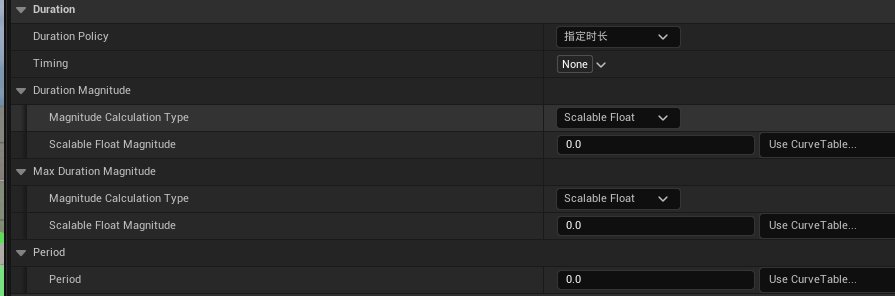
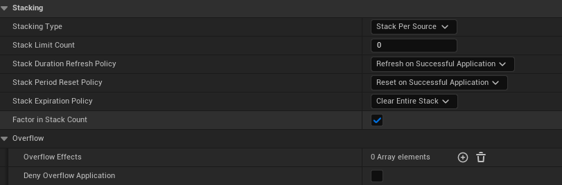

# Buff / Debuff 配置说明（策划用）

这份文档讲的是怎么把状态表里的一条状态，配成一个 GameplayEffect（下面简称 GE）。

回合制战斗里，一条状态活多久、什么时候结算，全由 GE 上的几个字段决定。

---

## 一、一条状态只需要想清楚三件事

配任何状态之前，先回答三个问题，剩下的都是填空。

**它什么时候消失？**

三种选法。立刻就没，不留状态；到时间就没，填个回合数；一直挂着，自己不消失。

**它跟着什么节奏算时间？**

两种。跟着回合走，每回合结束算一次；跟着出手走，角色每次出手算一次。

**这期间效果发生几次？**

只在刚加上时发生一次，或者每隔几回合（几次出手）再发生一次。

回答完这三句，字段就定死了。

---

## 二、三个问题对应哪些字段

编辑器里的 Duration 分组长这样。图里的每一项，都对应第一章里的一个问题：

| 你的回答 | 填哪个字段 | 怎么填 |
|---------|-----------|-------|
| 什么时候消失 | Duration Policy | 瞬时 / 指定时长 / 永久 |
| 跟着什么走 | Timing | 留空 = 回合结束；要跟出手走就选出手 |
| 持续多久 | Duration Magnitude | 填回合数 |
| 最长多久 | Max Duration Magnitude | 一般不填，0 表示不限 |
| 多久发生一次 | Period | 0 = 只发生一次，1 = 每回合一次，2 = 每两回合一次 |

图里 `Timing` 那一栏写着 `None`，就是"留空"的意思，按回合结束推进。

后面的例子里为了简短，把 `Duration Magnitude` 里的 `Scalable Float Magnitude` 简写成 `Duration`，`Max Duration Magnitude` 简写成 `Max Duration`。

Timing 的五个选项里，常用的就两个：

| 选项 | 什么时候推进 |
|------|------------|
| 留空（回合结束） | 每回合结束，绝大多数状态都用这个 |
| 攻击出手 | 角色攻击时，用来做"下一次攻击后消失" |
| 回合开始 | 每回合开始时 |
| 任意出手 | 攻击或防御都算 |
| 防御出手 | 只有防御时 |

不要选 `TimeAxis.Round` 这一层。它在回合开始和回合结束各算一次，状态会比预期早一半时间消失。

---

## 三、所有状态都落在六个格子里

把"什么时候消失"和"跟着什么走"一交叉，就是六个格子。你手上的状态基本都能塞进去。

| | 跟回合走 | 跟出手走 |
|---|---|---|
| 定时消失 | 狂怒、霜甲、流血、破甲、易伤 | 标记、专注、缴械 |
| 永久 | 战意、再生之力、血腥领域 | 基本用不上 |
| 立刻消失 | 技能直接伤害、立刻回血 | 用不上 |

第二列容易被漏掉，但你的表里有不少这种状态：标记、专注、缴械、连击准备、残影。它们的规则是"用掉就没了"，不是"过一回合就没了"。

---

## 四、六个格子各配一遍

### 1. 跟回合走、定时消失：狂怒

攻击力 +20%，持续 2 回合。

| 字段 | 填什么 |
|------|-------|
| Duration Policy | 指定时长 |
| Timing | 留空 |
| Duration | 2 |
| Period | 0 |
| Modifiers | 攻击力 ×1.2 |
| Granted Tags | Buff.Rage |

加上之后，第一个回合结束剩 1，第二个回合结束剩 0，状态自己消失。

同类的有霜甲、铁壁、破甲、虚弱诅咒、吸血之触、冰霜之力、破甲姿态。

### 2. 跟回合走、定时消失、每回合触发：流血

每回合掉 10 点血，持续 3 回合。

| 字段 | 填什么 |
|------|-------|
| Duration Policy | 指定时长 |
| Timing | 留空 |
| Duration | 3 |
| Period | 1 |
| Modifiers | HP -10（周期执行） |

这里唯一的新东西是 Period。它表示"每推进一格就执行一次效果"。填 1 是每回合掉一次血，填 2 是隔一回合掉一次。

掉血的 DoT 必须填 1。留 0 的话，效果只在刚加上时发生一次，之后就不掉血了。

同类的有血蚀、灼烧、中毒、冻伤，回血那边是自然恢复和大快朵颐。

### 3. 跟回合走、永久：再生之力

每回合回 8% 血，不会自己结束。

| 字段 | 填什么 |
|------|-------|
| Duration Policy | 永久 |
| Timing | 留空 |
| Period | 1 |
| Modifiers | HP +8% |

永久和定时的区别只有一条：会不会自己消失，别的字段照填。

如果一条永久状态不需要反复触发效果，比如战意那种按血量实时算加成的，Period 填 0。

同类的有不屈、狂暴之怒、血腥领域、战意。

### 4. 跟出手走、定时消失：标记

下次攻击必中，攻击完就没了。

| 字段 | 填什么 |
|------|-------|
| Duration Policy | 指定时长 |
| Timing | 攻击出手 |
| Duration | 1 |
| Period | 0 |
| Granted Tags | Buff.Mark |

这样就能"用掉就没了"：Timing 挂在攻击出手上，角色一攻击，状态的时间走一格，Duration 只有 1，正好到期。

最常见的错误是 Timing 忘了改。留空的话它会变成"一回合后消失"，跟设计意图完全不是一回事。

同类的有专注、缴械、连击准备，残影可以挂防御出手。

### 5. 跟回合走、只活一个回合：连击强化

本回合内连续命中伤害递增。

| 字段 | 填什么 |
|------|-------|
| Duration Policy | 指定时长 |
| Timing | 留空 |
| Duration | 1 |
| Period | 0 |
| Granted Tags | Buff.ComboBoost |

表里写"本回合"的，Duration 填 1 就可以。

同类的有反击窗口和格挡姿态。

### 6. 立刻消失：技能伤害

| 字段 | 填什么 |
|------|-------|
| Duration Policy | 瞬时 |
| 其它 | 字段会自动隐藏 |

瞬时状态不会出现在 Buff 栏，结算完就结束了，没有"持续"这回事。

---

## 五、需要多配点东西的状态

上面六个格子解决的是"活多久"。有几类状态还要额外设置。

### 叠层

霜寒、支配印记、烦躁、疲惫这些要叠层的状态，只填 Duration 不够，还要打开 Stacking 下面的字段。

| 字段 | 填什么 | 对应表里的哪条 |
|------|-------|--------------|
| Stacking Type | Stack Per Target | 允许叠加 |
| Stack Limit Count | 霜寒填 5，印记填 12 | 叠加上限 |
| Stack Duration Refresh Policy | Refresh on Successful Application | 重新施加时把剩余回合重置回初始值 |
| Stack Period Reset Policy | Reset on Successful Application | 状态带 Period 时，重复施加重置周期计时 |
| Stack Expiration Policy | Clear Entire Stack | 到期时清空所有层 |

Stacking Type 有三个选项。`No Stacking` 是不叠层，另外两个的区别在"谁施加的算不算同一份"：

| 选项 | 含义 | 什么时候用 |
|------|------|-----------|
| Stack Per Target | 不论谁施加，打到同一个目标就合并层数 | 默认用这个。多个角色都能上同一个状态时，层数会累加 |
| Stack Per Source | 同一个施加者再次施加才累加，不同角色各自算一份 | 层数需要按"谁上的"分开算时才用 |

> 图里 `Stacking Type` 显示的是 `Stack Per Source`，它用来对照字段在面板里的位置；按上表应选 `Stack Per Target`。

Stacking 下面还有 `Factor in Stack Count`，勾上后层数会参与效果强度的计算（每层加 10% 的话，5 层就是 50%）。再往下的 `Overflow` 管的是层数满了之后怎么办，一般不用填。

Stacking 不配的话，重复施加只会把时间刷新一遍，层数永远是一，看起来就像叠加没生效。

### 叠满触发别的状态

霜寒 5 层触发冻结、支配印记 3 层触发驯服，这类要做成两段。

第一段是叠层状态本身，比如霜寒，上限 5 层。在它上面挂一个 Additional Effects 组件，条件写"层数达到 5"，触发内容写"施加冻结"，触发后清空层数。

第二段是冻结这个状态，正常配：指定时长、Timing 留空、Duration 填 1，再打上 `State.Control.Frozen` 标记。

表里所有的"叠满触发"都是这个套路，换一下层数和触发的状态就行。

### 控制状态

冻结、眩晕、沉默、手铐禁锢这些配起来比普通状态还简单。

Duration Policy 填指定时长，Duration 填 1，然后在 Granted Tags 里打上对应标记，比如 `State.Control.Frozen` 或 `State.Control.Stun`。

GE 能做的就这些：打标记、倒计时、到点移除。"不能行动"是回合管理器读到标记之后决定的，不在 GE 里配。

互斥那边，你的表里写了冻结、麻痹、眩晕两两不能共存。做法是在施加新的控制状态之前，先把身上已有的同类控制移除。

### 护盾

护盾拆成两部分看。

GE 负责给一个护盾值（存进属性）并计时，到期状态消失。

"被打碎就消失"要靠另一套逻辑：伤害结算时先扣护盾值，扣到零再由技能或系统把状态移除。这部分不在 GE 配置范围内。

### 条件生效

狂暴化（血量低于 30% 才加成）、战意（血越少攻越高）这类，Duration Policy 选永久，Period 填 0，加成用带条件的计算方式，运行时读血量决定给多少。

条件写在效果计算里。用 Duration 表达不了条件。

---

## 六、容易配错的地方

最常见的一个是 Timing 选了 `TimeAxis.Round`。它是最上面那一层，回合开始和回合结束都会推进，状态会提前一半时间消失。要么留空，要么明确选 `Round.Start` 或 `Round.End`。

另一个是 Duration 填 0 当成永久。填 0 的意思是"立刻到期"，不是"一直存在"。要永久就把 Duration Policy 改成永久。

"用一次就没了"的状态如果留空了 Timing，会变成按回合消失，这类一定要把 Timing 改成出手相关的选项。

DoT 忘了填 Period，效果只在施加时发生一次，掉血状态就不掉血了。

叠层没配 Stacking，重复施加只会刷新时间，层数不涨。

---

## 七、状态表归位对照

| 表里的状态 | 归到哪一格 | 还要配什么 |
|-----------|-----------|-----------|
| 狂怒、霜甲、铁壁、破甲姿态、吸血之触、冰霜之力、疾风步 | 定时 + 回合 | 无 |
| 破甲、减速、虚弱诅咒、失明、迟缓、易伤 | 定时 + 回合 | 无 |
| 绝对控制、血契加持、暴怒连打、油脂护体、强化电流、反伤装甲、大快朵颐 | 定时 + 回合 | 无 |
| 流血、血蚀、灼烧、中毒、冻伤 | 定时 + 回合 | Period 填 1 |
| 自然恢复 | 定时 + 回合 | Period 填 1，另加回体力 |
| 再生之力 | 永久 | Period 填 1 |
| 战意、不屈、狂暴之怒、血腥领域 | 永久 | Period 填 0 |
| 狂暴化 | 永久 | 加成用条件计算 |
| 标记、专注、缴械、连击准备 | 定时 + 出手 | 无 |
| 残影 | 定时 + 出手 | Timing 用防御出手 |
| 连击强化、反击窗口 | 定时 + 回合 | Duration 填 1 |
| 霜寒、支配印记、烦躁、疲惫、残虐快感、破绽、血咒 | 定时 + 回合 | 配 Stacking |
| 霜寒→冻结、印记→驯服/大招、中毒→毒素爆发、灼烧→禁疗、诅咒→深度诅咒 | 两段式 | 叠层加 Additional Effects |
| 冻结、眩晕、沉默、手铐禁锢、麻痹、驯服、失衡 | 定时 + 回合 | Duration 填 1，加控制标记 |
| 护盾、净化之触、伤害免疫 | 定时 + 回合 | 需要伤害拦截或触发移除 |
| 蓄力、吟唱、不可选中 | 定时 + 回合 | Duration 按表填 |
| 技能直接伤害、立刻回血 | 立刻消失 | 无 |

表里没列到的状态，按第一章的三个问题走一遍，自己就能归位。

---

> 字段的中文说明写在 `GameplayEffect.h` 里，编辑器里把鼠标悬停在字段名上也能看到。
> 回合节奏和状态机细节见 `Document/Designer/33Game/回合制战斗状态机.md`。
