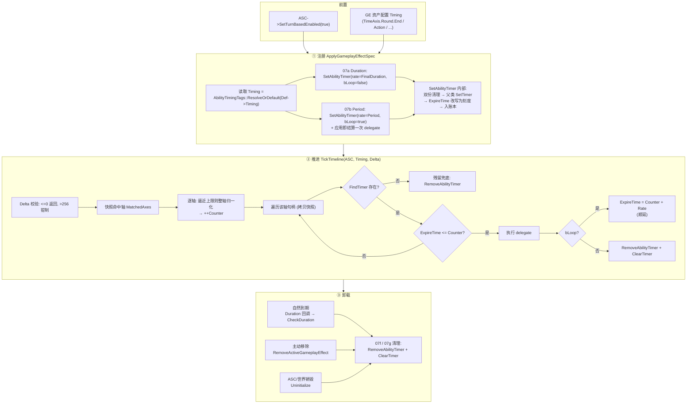
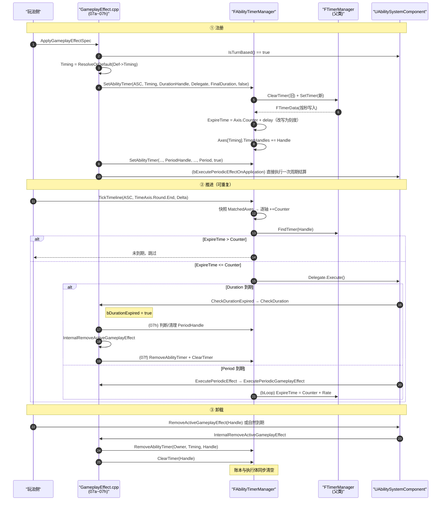

# 回合制下单个 GameplayEffect 的完整生命周期

> 本文是 `回合制改造方案.md` 的**流程视角**补充：把「一个 GE，从被 Apply 注册计时，到被推进结算，最后被卸载清理」的全过程按时间顺序串一遍。
>
> - 代码基线：UE **5.8** 引擎源码拷贝 + 本项目 `GAS_MOD_05~13` 改造
> - 插件路径：`GameWork/Plugins/GameplayAbilities`
> - 本文只描述**回合制路径**（`ASC->IsTurnBased() == true`）；实时制路径未改动，仅在对比时提及。
> - 检索全部改动块：源码里搜 `GAS_MOD_`。

---

## 0. 角色总览

| 角色 | 类型 / 位置 | 职责 |
|------|------------|------|
| `UGameplayEffect::Timing` | `GameplayEffect.h`（`GAS_MOD_11`） | GE 资产上声明「挂在哪条时间轴」；留空 = `TimeAxis.Round.End` |
| `AbilityTimingTags` | `AbilityTimingTags.h/.cpp`（`GAS_MOD_10`，原生 Tag） | 定义 `TimeAxis.*` 层级；`ResolveOrDefault()` 做默认回落 |
| `UAbilitySystemComponent::bTurnBased` | `AbilitySystemComponent.h`（`GAS_MOD_06`） | 该 ASC 是否走回合驱动 |
| `FAbilityTimerManager` | `AbilityTimerManager.h/.cpp`（`GAS_MOD_09`） | 继承 `FTimerManager`，按时机分轴维护刻度与 Timer 句柄 |
| `FAbilityTimerContainer` / `FAbilityTimerAxis` | 同上 | 每 ASC 一个容器；容器内每个时机一条轴（`Counter` + `TimerHandles`） |
| `UAbilitySystemGlobals` | `AbilitySystemGlobals.h/.cpp`（`GAS_MOD_05`） | 全局持有唯一 `FAbilityTimerManager` 实例，`FinishDestroy` 时销毁 |
| `GameplayEffect.cpp` 各调用点 | `GAS_MOD_07a~07h` | Timer 的注册 / 到期判定 / 清理在回合制分支下改走 `FAbilityTimerManager` |
| `TickTimeline` | `AbilityTimerManager.cpp` + 蓝图库（`GAS_MOD_12`） | **唯一**推进入口，由玩法侧手动调用 |

### 核心数据结构

```cpp
struct FAbilityTimerAxis          // 一条时间轴 = 一个时机
{
    int32 Counter = 0;            // 已推进到的刻度（单调递增，逼近上限时整轴平移归一化）
    TArray<FTimerHandle> TimerHandles;   // 挂在该时机上的 Timer 句柄（账本）
};

struct FAbilityTimerContainer     // 一个 ASC 的计时容器
{
    TMap<FGameplayTag, FAbilityTimerAxis> Axes;   // key = 时机 Tag
};
```

**关键不变式（后文反复用到）**

1. **双份存储**：每个回合制 Timer 同时存在于两处——
   - 父类 `FTimerManager` 的 `FTimerData`（真正被执行体，含 `ExpireTime` / `bLoop` / `Rate` / 委托）
   - `Axes[Timing].TimerHandles`（账本，仅句柄）
   两处必须**同步增删**，否则残留无效句柄。
2. **单位是刻度**：`FTimerData::ExpireTime` 与 `Axis.Counter` 都是「该时机的刻度数」（`double`），**不是秒**。注册时 `SetTimer` 先按秒写入，随后被立即改写。
3. **轴只增不删**：某时机一旦被注册过就常驻（`FindOrAdd`），哪怕句柄清空。判定时以 `Counter` 为准。`Counter` 单调递增、无重置入口，但在逼近 `int32` 上限时会整轴平移归一化（见 4.2.4）。
4. **推进只向上聚合**：`InTiming.MatchesTag(AxisKey)` 为真 ⟺ `AxisKey` 等于 `InTiming` 或是其**祖先**。所以「推 `Action.Attack`」会同时命中 `Action.Attack` 轴与父级 `Action` 轴；反之「推 `Action`」**不会**命中 `Action.Attack` 轴。

---

## 1. 全景流程



---

## 2. 前置条件

| 条件 | 说明 |
|------|------|
| `ASC->IsTurnBased() == true` | 默认 `false`，保持引擎原生实时行为。仅在 `true` 时 `GameplayEffect.cpp` 的各分支才走 `FAbilityTimerManager`。 |
| `GE.DurationPolicy != Instant` | Instant 不入 `ActiveGameplayEffects`，没有 Timer，不涉及本流程。 |
| `GE.DurationPolicy == HasDuration` | Infinite 的 `Duration <= 0`，`CheckDuration` 直接 `break`，也不会注册 Duration Timer。 |
| `GE.Timing` | 可留空。留空时 `ResolveOrDefault()` 回落到 `TimeAxis.Round.End`（在**注册点**回落，而不是 CDO 构造期——原生 Tag 在 CDO 构造时可能尚未注册）。 |
| Period > 0 | 只有 `Period > NO_PERIOD` 才注册 Period Timer。 |

---

## 3. 阶段一：注册

### 3.1 触发点

`FActiveGameplayEffectsContainer::ApplyGameplayEffectSpec()` → `AddActiveGameplayEffect` 尾部，即在 GE 已经进入 `ActiveGameplayEffects` 数组、且已完成属性修改 / GrantedTags / GameplayCue 之后，才开始注册 Timer。

此处 `bSetDurationTimer` / `bSetPeriodTimer` 由调用方根据「新建 or 叠加栈」决定是否注册。

### 3.2 Duration Timer 注册（`07a`）

```cpp
FTimerDelegate Delegate = FTimerDelegate::CreateUObject(
    Owner, &UAbilitySystemComponent::CheckDurationExpired, AppliedActiveGE->Handle);

const FGameplayTag Timing =
    AbilityTimingTags::ResolveOrDefault(Def ? Def->Timing : FGameplayTag());

if (!Owner->IsTurnBased())
{
    Owner->GetWorld()->GetTimerManager().SetTimer(
        AppliedActiveGE->DurationHandle, Delegate, FinalDuration, false);
}
else
{
    UAbilitySystemGlobals::Get().GetAbilityTimerManager().SetAbilityTimer(
        Owner, Timing, AppliedActiveGE->DurationHandle, Delegate,
        /*InRate=*/FinalDuration, /*bInLoop=*/false);
}
```

兜底分支：若 `DurationHandle` 仍然无效，实时制用 `SetTimerForNextTick`，**回合制改为 `SetAbilityTimer(..., 1.f, false)`（1 个刻度后触发）**。

> 注意 `FinalDuration` 已被上游钳制：`<= 0` 会被抬到 `0.1`（引擎原有逻辑），因此在回合制下「Duration = 1」表示「持续 1 个刻度」。

### 3.3 Period Timer 注册（`07b`）

```cpp
FTimerDelegate Delegate = FTimerDelegate::CreateUObject(
    Owner, &UAbilitySystemComponent::ExecutePeriodicEffect, AppliedActiveGE->Handle);

const FGameplayTag Timing = AbilityTimingTags::ResolveOrDefault(Def->Timing);

if (!Owner->IsTurnBased())
{
    if (Def->bExecutePeriodicEffectOnApplication)
        TimerManager.SetTimerForNextTick(Delegate);      // 实时制：下一帧补一次
    TimerManager.SetTimer(PeriodHandle, Delegate, Spec.GetPeriod(), true);
}
else
{
    if (Def->bExecutePeriodicEffectOnApplication)
        Delegate.ExecuteIfBound();                        // 回合制：无"下一帧"，直接结算
    AbilityTimerManager.SetAbilityTimer(Owner, Timing, PeriodHandle, Delegate,
                                       /*InRate=*/Spec.GetPeriod(), /*bInLoop=*/true);
}
```

**差异要点**：实时制靠 `SetTimerForNextTick` 实现「应用即触发一次」，回合制没有「下一帧」语义，改为**同步直接执行一次**委托。

### 3.4 抑制解除时的 Period 重注册（`07e`）

`AddActiveGameplayEffectGrantedTagsAndModifiers` 中，GE 从 `bIsInhibited` 恢复时，按 `PeriodicInhibitionPolicy` 重注册 Period Timer：
- `NeverReset`：不重置
- `ResetPeriod`：重置周期
- `ExecuteAndResetPeriod`：实时制用 `SetTimerForNextTick`，**回合制改为直接 `Delegate.ExecuteIfBound()`**，随后 `SetAbilityTimer(..., Period, true)`。

### 3.5 `SetAbilityTimer` 内部：注册到底做了什么

这是整条链路的**枢纽**，务必理解：

| 步骤 | 动作 | 目的 |
|------|------|------|
| 1 | `if (!ASC) return;` | 空保护 |
| 2 | `InTiming.IsValid() == false` → `UE_LOG` 警告 + `return` | 没有时机就无法建轴，拒绝注册 |
| 3 | `InTiming == TimeAxis.Round` → `UE_LOG` 警告（**不阻止**） | 命名空间标签会被 Start/End 各推一次 = 一回合 2 次，属于误配提示 |
| 4 | `ClearTimer(OutHandle)` | 清掉父类 `FTimerManager` 里的旧 `FTimerData` |
| 5 | `RemoveAbilityTimerByHandle(ASC, OutHandle)` | 从**所有轴**的账本里删掉旧句柄（GE 换 Timing 也能兜住） |
| 6 | `if (InRate > 0.f) SetTimer(OutHandle, InDelegate, InRate, bInLoop, InFirstDelay)` | 复用父类的注册逻辑，拿到有效 `FTimerHandle` 与 `FTimerData` |
| 7 | `FAbilityTimerAxis& Axis = GetAbilityTimerAxis(ASC, InTiming)` | `FindOrAdd` 该时机的轴（不存在则以 `Counter = 0` 新建） |
| 8 | `Data->ExpireTime = Axis.Counter + ActualFirstDelay` | **把父类写入的「秒」改写为「刻度」**；`ActualFirstDelay = (InFirstDelay >= 0) ? InFirstDelay : InRate` |
| 9 | `Axis.TimerHandles.AddUnique(OutHandle)` | 记入该轴账本 |

> `InRate <= 0` 时什么都不做，`OutHandle` 保持无效 → 上层 `ensureMsgf` 兜底分支接手。
>
> `FindTimer` 是 `FTimerManager::protected` 成员，子类可直接访问，用来读写 `ExpireTime` / `bLoop` / `Rate`。

**注册后的数据落点（例：`Timing = TimeAxis.Round.End`，Duration=3，Period=2）**

```
FAbilityTimerManager
└─ AbilityTimerContainers[ASC]
   └─ Axes["TimeAxis.Round.End"]           ← 轴由 07a 首次创建
      ├─ Counter = 0
      └─ TimerHandles = [ DurationHandle, PeriodHandle ]
                          │                │
父类 FTimerManager ◄──────┘                │
   ├─ FTimerData(DurationHandle).ExpireTime = 0 + 3 = 3, bLoop=false
   └─ FTimerData(PeriodHandle).ExpireTime   = 0 + 2 = 2, bLoop=true
```

---

## 4. 阶段二：推进（Tick）

### 4.1 入口

```cpp
// C++
UAbilitySystemGlobals::Get().GetAbilityTimerManager()
    .TickTimeline(ASC, AbilityTimingTags::TAG_TIMEAXIS_ROUND_END, /*Delta=*/1);

// 蓝图（GAS_MOD_12）
UAbilitySystemBlueprintLibrary::TickTimeline(ASC, Timing, Delta);
```

`TickTimeline` 只是取全局管理器转调，管理器**不会**被 `World->Tick` 驱动（`FAbilityTimerManager` 从不调用父类 `Tick`），因此「什么时候算回合结束 / 一次出手」完全由玩法侧决定。

### 4.2 `TickTimeline` 逐行拆解

```
TickTimeline(ASC, InTiming, Delta):
  guard: !ASC || !InTiming.IsValid() → return
  guard: Delta <= 0 → return                         // 无效步进直接忽略
  guard: Delta > MaxDeltaPerCall(256) → 警告并钳制   // 防误配巨大 Delta 空转主线程 / 推爆刻度
  Container = GetAbilityTimerContainer(ASC)          // FindOrAdd

  for Step in [0, Delta):                            // Delta 步进
      ── 快照阶段 ──
      MatchedAxes = {}
      for (AxisKey, _) in Container.Axes:
          if InTiming.MatchesTag(AxisKey):            // ← 层级匹配（含父级聚合）
              MatchedAxes += AxisKey

      ── 执行阶段 ──
      for AxisTag in MatchedAxes:
          Axis = Container.Axes.Find(AxisTag)
          if !Axis: continue                          // 本步进内已被移除（防御）

          if Axis->Counter >= TimelineRebaseThreshold(1<<30):
              RebaseAxis(*Axis, TimelineRebaseThreshold)  // ← 整轴平移归一化，见 4.2.4

          CurrentCounter = ++Axis->Counter            // 先推进刻度
          Handles = Axis->TimerHandles                // ← 按值拷贝快照

          for Handle in Handles:
              Data = FindTimer(Handle)
              if !Data:                               // Timer 已被外部清掉
                  RemoveAbilityTimer(ASC, AxisTag, Handle)   // 残留兜底
                  continue

              if Data->ExpireTime <= (double)CurrentCounter:
                  bLoop = Data->bLoop; Rate = Data->Rate     // ← 执行前快照
                  execute delegate                            // 见 4.2.1
                  if bLoop:
                      if (DataAfter = FindTimer(Handle))      // ← 回调可能已清掉它
                          DataAfter->ExpireTime = CurrentCounter + Rate
                  else:
                      RemoveAbilityTimer(ASC, AxisTag, Handle)
                      ClearTimer(Handle)
```

#### 4.2.1 委托为什么不能直接 `Execute()`

`FTimerUnifiedDelegate::Execute()` **未带 `ENGINE_API`**（引擎内同 DLL 可直呼）。插件跨 DLL 调用会 `LNK2019`，所以实际实现改为取内部变体：

```cpp
if (FTimerDelegate* NativeDelegate = Data->TimerDelegate.VariantDelegate.TryGet<FTimerDelegate>())
{
    NativeDelegate->Execute();
}
```

`TVariant::TryGet` 与 `TDelegate::Execute` 都是 inline，无链接依赖。

#### 4.2.2 三处「快照」的含义

| 快照 | 位置 | 防止的问题 |
|------|------|-----------|
| `MatchedAxes` | 每个 `Step` 开头 | 回调里移除 GE / 修改容器导致 `Axes` 迭代器失效 |
| `Handles`（按值拷贝） | 每个轴推进前 | 回调里移除 GE 导致 `TimerHandles` 遍历失效 |
| `bLoop` / `Rate` | 执行 delegate 前 | 回调（如 Duration 到期移除 GE）让 `Data` 失效 |

#### 4.2.3 三个容易忽略的时序细节

- **先 `++Counter` 再判定**：注册刻 `ExpireTime = Counter + delay`，所以 `Duration = 1` 的效果会在**下一次推进**该轴时到期（而不是注册当刻）。
- **`MatchedAxes` 是每步重取的**：若某个回调在本步内**新建了一条轴**，它不在本步快照里，要在**下一个 `Step`**（或下一次 `TickTimeline`）才会被推进。
- **`Delta` 有上下界**：`Delta <= 0` 直接返回（原实现是静默空转），`Delta > 256` 会被钳制并打警告。

#### 4.2.4 刻度不会溢出：Delta 钳制 + 整轴归一化

`Axis.Counter` 是 `int32`，且**没有运行时重置入口**——唯一归零机会是轴首次创建（`FindOrAdd` 走默认成员初值 `0`）。因此做了两层防御：

| 层 | 位置 | 作用 |
|---|------|------|
| **Delta 钳制** | `TickTimeline` 入口 | `Delta <= 0` → 返回；`Delta > MaxDeltaPerCall(256)` → `UE_LOG` 警告后钳制为 256。避免 `O(Delta × 轴数)` 空转主线程，也堵住"一次调用就把刻度推爆"的路径。 |
| **整轴归一化** | 每个轴推进前 | `Axis.Counter >= TimelineRebaseThreshold(1<<30)` 时调用 `RebaseAxis`，把 `Counter` 与**轴上所有 Timer 的 `ExpireTime`** 同减 `1<<30`。 |

归一化为什么安全：判定只看**差值** `ExpireTime - Counter`（`<=` 判定与 `GetAbilityTimerRemaining` 都是差值），整轴同步平移后差值不变，所以**触发时机、触发顺序、返回值完全一致**，纯粹是把刻度拉回小值区间。平移后 `ExpireTime` 不会变负——因为不变式保证轴上任一 Timer 都有 `ExpireTime >= Counter`（等待中的在未来，循环的顺延到 `Counter + Rate`）。

> 为什么阈值取 `1<<30` 而不是 `INT32_MAX`：`++Counter`、`Counter + Rate` 都还需要在 `int32`/加法上留余量，留一倍空间可彻底避免边界处的溢出。
>
> 不这么做会怎样：`++int32` 溢出是**未定义行为**，环绕后 `Counter` 变成大负数，而"溢出前已注册"的 Timer 的 `ExpireTime` 还是接近 `INT32_MAX` 的正数 → 这些 Timer **永久不再触发**（Duration 永不到期、Period 永不 tick），表现为"一半效果正常、一半静默卡死"且不报错。

### 4.3 到期回调的两条链路

`SetAbilityTimer` 传入的 delegate 决定走向：

#### A. Duration 到期 → `CheckDurationExpired`

```
TickTimeline 执行 delegate
 └─ UAbilitySystemComponent::CheckDurationExpired(Handle)          [AbilitySystemComponent.cpp]
     └─ FActiveGameplayEffectsContainer::CheckDuration(Handle)     [GameplayEffect.cpp]
```

`CheckDuration` 在回合制下的处理（`07c` / `07h` / `07d`）：

| 步骤 | 回合制行为 | 标记 |
|------|-----------|------|
| 到期判定 | 世界时间判定结果被**强制覆盖**为 `bDurationExpired = true`（回调由 `TickTimeline` 精确触发，无需再比世界时间） | `07c` |
| 按 `StackExpirationPolicy` 分支 | 与引擎一致，产出 `StacksToRemove` / `CheckForFinalPeriodicExec` / `RefreshStartTime` / `RefreshDurationTimer` | — |
| `CheckForFinalPeriodicExec`（移除前补最后一次 Period 结算） | 用 `FAbilityTimerManager` 判断：`TimerExists(PeriodHandle)` + `GetAbilityTimerRemaining(...) <= KINDA_SMALL_NUMBER` 才补结算，然后 `RemoveAbilityTimer` + `ClearTimer` | `07h` |
| 移除 | `InternalRemoveActiveGameplayEffect(ActiveGEIdx, StacksToRemove, false)` | — |
| `RefreshDurationTimer` | 回合制按**刻度**重注册：`SetAbilityTimer(Owner, Timing, Effect.DurationHandle, Delegate, Duration, false)` | `07d` |

`StackExpirationPolicy` 分支结果速查：

| Policy | StacksToRemove | 其它 |
|--------|---------------|------|
| `ClearEntireStack`（默认） | `-1`（全清） | `CheckForFinalPeriodicExec = true` |
| `RemoveSingleStackAndRefreshDuration` | `1` | `CheckForFinalPeriodicExec = (StackCount == 1)`、`RefreshStartTime`、`RefreshDurationTimer` |
| `RefreshDuration` | 不变（`-2`） | `RefreshStartTime`、`RefreshDurationTimer`（**不移除 GE**） |

> 因此：**默认（非叠加）GE 的路径就是 `ClearEntireStack` → 移除**；只有配了叠加策略的 GE 才会在到期时续命。
>
> `InternalRemoveActiveGameplayEffect` 若失败（`Effect.DurationHandle.IsValid() == false`），`07d` 会直接兜底移除 GE 并 `check(Effect.IsPendingRemove)`。

#### B. Period 到期 → `ExecutePeriodicEffect`

```
TickTimeline 执行 delegate
 └─ UAbilitySystemComponent::ExecutePeriodicEffect(Handle)
     └─ FActiveGameplayEffectsContainer::ExecutePeriodicGameplayEffect(Handle)
         └─ InternalExecutePeriodicGameplayEffect(Effect)      // 走 Instant GE 的 Modifier 执行
```

因为 Period 的 `bLoop = true`，`TickTimeline` 会在回调返回后把 `ExpireTime` **顺延**到 `CurrentCounter + Rate`，形成周期触发。

> 若回调本身把 GE 移除了（比如周期伤害致死触发死亡清 Buff），`FindTimer(Handle)` 会返回 `nullptr`，顺延被跳过——这是**有意**的，避免给已死 Timer 续命。

---

## 5. 阶段三：卸载

### 5.1 三条卸载路径

| 路径 | 触发场景 | 入口 |
|------|---------|------|
| ① 自然到期 | Duration 轴到期 → `CheckDuration` → `InternalRemoveActiveGameplayEffect` | 见 4.3-A |
| ② 主动移除 | 业务调用 `ASC->RemoveActiveGameplayEffect(Handle, Stacks)` | `UAbilitySystemComponent::RemoveActiveGameplayEffect` → `FActiveGameplayEffectsContainer::RemoveActiveGameplayEffect` → `InternalRemoveActiveGameplayEffect` |
| ③ 容器销毁 | ASC 销毁 / 世界拆除 | `FActiveGameplayEffectsContainer::Uninitialize()`（`07g`） |

三条路径最终都汇聚到**同一段清理代码**（`07f`，位于 `InternalRemoveActiveGameplayEffect` 内；③ 在 `Uninitialize` 里另有等价的一份 `07g`）。

### 5.2 清理动作

```cpp
// 读取该 GE 所属的时机
const FGameplayTag Timing = AbilityTimingTags::ResolveOrDefault(Effect.Spec.Def->Timing);

if (Effect.DurationHandle.IsValid())
{
    if (!Owner->IsTurnBased())
        World->GetTimerManager().ClearTimer(Effect.DurationHandle);
    else
    {
        AbilityTimerManager.RemoveAbilityTimer(Owner, Timing, Effect.DurationHandle);  // 出账本
        AbilityTimerManager.ClearTimer(Effect.DurationHandle);                        // 清 FTimerData
    }
}
// PeriodHandle 同上
```

**必须成对调用**：
- `RemoveAbilityTimer` 只动 `Axes[Timing].TimerHandles`（账本）
- `ClearTimer` 只动父类 `FTimerManager`（执行体）

少任何一步都会留下「有句柄无 Timer」或「有 Timer 无句柄」的脏数据。

`RemoveAbilityTimer` 自身还带一层容错：**先在指定 `Timing` 的轴上删；删不到（返回 0）则退化为遍历所有轴按句柄查找**。这覆盖了「GE 中途改了 `Timing`，句柄实际挂在别的轴」的情况。

### 5.3 残留句柄的兜底

即使 5.2 漏了（例如外部直接 `ClearTimer` 了句柄），`TickTimeline` 也有兜底：

```cpp
FTimerData* Data = FindTimer(Handle);
if (!Data)
{
    RemoveAbilityTimer(ASC, AxisTag, Handle);   // 账本里清掉幽灵句柄
    continue;
}
```

### 5.4 全局管理器的销毁

与单个 GE 无关，但属于生命周期的一部分：

```
UAbilitySystemGlobals::FinishDestroy()      [AbilitySystemGlobals.cpp, GAS_MOD_05]
 └─ DestroyAbilityTimerManager()            // 销毁全局 FAbilityTimerManager
     └─ Super::FinishDestroy()
```

管理器是**懒加载**的单例（首次 `GetAbilityTimerManager()` 时 `new`），随 `UAbilitySystemGlobals` 一起销毁。

---

## 6. 端到端时序图



---

## 7. 实例走查：`Duration = 3`、`Period = 2`、`Timing = TimeAxis.Round.End`

设 `bExecutePeriodicEffectOnApplication = true`（默认），每个回合末调用一次 `TickTimeline(ASC, Round.End)`。

| 时刻 | 轴 `Counter` | Duration 句柄 `ExpireTime=3` | Period 句柄 `ExpireTime=2 (loop)` | 本回合发生的结算 |
|------|-------------|------------------------------|-----------------------------------|-----------------|
| Apply | 0 | 3 | 2 | 应用即结算 1 次 Period（`ExecuteIfBound`） |
| 第 1 次 Tick | 0 → 1 | 3 > 1，跳过 | 2 > 1，跳过 | 无 |
| 第 2 次 Tick | 1 → 2 | 3 > 2，跳过 | **2 ≤ 2 → 触发 Period**，顺延为 `2 + 2 = 4` | Period 第 2 次结算 |
| 第 3 次 Tick | 2 → 3 | **3 ≤ 3 → 触发 Duration** → `CheckDuration` | 4 > 3，但已被 Duration 回调连带清理 | Duration 到期，GE 移除 |

第 3 次 Tick 内部的**顺序细节**（同轴内按注册先后，Duration 先于 Period）：

1. `++Counter` → 3
2. 遇到 `DurationHandle`：`ExpireTime(3) <= 3` → 执行 `CheckDurationExpired`
3. `CheckDuration`：`bDurationExpired = true` → `ClearEntireStack` → `StacksToRemove = -1`、`CheckForFinalPeriodicExec = true`
4. `07h`：Period 剩余 = `4 - 3 = 1 > KINDA_SMALL_NUMBER` → **不补结算**；`RemoveAbilityTimer` + `ClearTimer(PeriodHandle)`
5. `InternalRemoveActiveGameplayEffect(-1)` → `07f` 清 `DurationHandle`
6. `TickTimeline` 的句柄循环继续走到 `PeriodHandle`（遍历的是**拷贝快照**）→ `FindTimer` 返回 `nullptr` → 走**残留兜底** `RemoveAbilityTimer`

**结果**：3 个回合内 Period 结算 2 次（应用时 1 次 + 第 2 回合 1 次），第 3 回合到期移除。与「持续 3 回合、每 2 回合触发一次」的策划预期一致。

---

## 8. 检查清单（写调用代码时对照）

- [ ] `ASC->SetTurnBasedEnabled(true)` 是否已开启？（否则走的是世界时间 Timer，本流程完全不生效）
- [ ] `TickTimeline` 的 `Timing` 是否与 GE 上配的 `Timing` **同层或更细**？（推父标签不会触发子标签轴）
- [ ] 回合类效果是否只配了**叶子**（`Round.Start` / `Round.End`）而没配 `TimeAxis.Round`？配了会一回合触发两次。
- [ ] 推进时机是否由玩法侧真正调用了？（引擎不负责判定「什么时候算回合结束 / 一次出手」）
- [ ] 自建清理代码时，是否 `RemoveAbilityTimer` + `ClearTimer` **成对**调用？（且**不能**用 `World->GetTimerManager().ClearTimer()` 清回合 Timer）
- [ ] 主动移除后是否确认 `Axes[Timing].TimerHandles` 与父类 `FTimerData` 都已清空？

---

## 9. 已知边界与注意事项

| 项 | 说明 |
|----|------|
| **轴常驻不回收** | `AbilityTimerAxis` 一旦创建就常驻，句柄清空后轴本身不会被删；`Counter` 单调递增且无重置入口（仅在逼近 `int32` 上限时整轴平移归一化，见 4.2.4）。长期运行的战斗可接受，但需知晓。 |
| **无"每场战斗重置"接口** | 同一 ASC 的第二场战斗会从上一场的刻度继续（例如"第 13 回合"）。若策划要求每场从 1 开始，需要新增 `ResetTimeline`：**必须同时清掉轴上所有 Timer（`ClearTimer`）再把 `Counter` 归零**——只归零会让在途 Timer 认为"还要等十万回合"。 |
| **Delta 钳制** | `Delta > 256` 会被静默钳制（仅打 `UE_LOG` 警告）。因此"一次调用快进 1000 回合"不会被如实执行，需分批调用。 |
| **容器条目不自动回收** | `AbilityTimerContainers` 以 `TWeakObjectPtr<UAbilitySystemComponent>` 为 key，ASC 销毁后 key 失效但 **entry 仍驻留于全局单例**（当前无清理逻辑）。存在感较低但属于潜在增长点，若要收敛需自行加 `Compact()`。 |
| **中途切换 Timing** | `RemoveAbilityTimer` 的「退化遍历所有轴」是兜底，但 **`Counter` 不会迁移**——句柄会挂在旧轴的账本里直到本次移除；新轴从自己的刻度重新起算。 |
| **`GetTimeRemaining` 未改造** | 回合制下 Stack 叠加 carryover 的时间计算仍按世界时间；核心 Duration/Period 不受影响。 |
| **动态切换回合制/实时制** | 切回实时制时，已在容器里的回合 Timer 需迁移或清理，否则两套系统会同时驱动同一个 GE。 |
| **预测与网络** | 各时机刻度在权威端由 `FAbilityTimerManager` 维护，**不随 ASC 复制**；客户端做回合表现需另行同步。预测路径（`bInvokePredictedEffects`）与回合 Timer 的交互需单独验证。 |
| **`MatchedAxes` 快照时机** | 回调中新注册的轴不会在**本步进**内被推进，要到下一步才生效。 |
| **命名空间标签校验** | `SetAbilityTimer` 只对 `TimeAxis.Round` 发警告；`TickTimeline` 侧**没有**类似校验，传无效 Tag 会被静默 `return`。 |

---

## 附：代码坐标速查

| 内容 | 位置 |
|------|------|
| Duration 注册 `07a` | `Private/GameplayEffect.cpp:4503-4550` |
| Period 注册 `07b` | `Private/GameplayEffect.cpp:4557-4604` |
| 抑制解除重注册 `07e` | `Private/GameplayEffect.cpp:4742-4789` |
| 卸载清理 `07f` | `Private/GameplayEffect.cpp:5051-5095` |
| `Uninitialize` 清理 `07g` | `Private/GameplayEffect.cpp:5576-5626` |
| 到期判定 `07c` | `Private/GameplayEffect.cpp:5704-5724` |
| 末次周期结算 `07h` | `Private/GameplayEffect.cpp:5753-5824` |
| Duration 重注册 `07d` | `Private/GameplayEffect.cpp:5844-5891` |
| `TickTimeline` 实现（含 Delta 钳制 / 归一化调用） | `Private/AbilityTimerManager.cpp:41-142` |
| `RebaseAxis` 整轴归一化实现 | `Private/AbilityTimerManager.cpp:144-163` |
| 防御常量（`MaxDeltaPerCall` / `TimelineRebaseThreshold`） | `Private/AbilityTimerManager.cpp:14-28` |
| `SetAbilityTimer` 实现 | `Private/AbilityTimerManager.cpp:165-207` |
| `RemoveAbilityTimer` / `ByHandle` | `Private/AbilityTimerManager.cpp:249-291` |
| 轴 / 容器结构体 | `Public/AbilityTimerManager.h:40-55` |
| `RebaseAxis` 声明 | `Public/AbilityTimerManager.h:96-101` |
| `CheckDurationExpired` / `ExecutePeriodicEffect` | `Private/AbilitySystemComponent.cpp:1203-1236` |
| 蓝图推进入口 `TickTimeline` | `Private/AbilitySystemBlueprintLibrary.cpp:1652-1660` |
| 全局管理器持有与销毁 | `Private/AbilitySystemGlobals.cpp:66-95` |
| 时机 Tag 定义与回落 | `Public/AbilityTimingTags.h:30-66` |

> 全部改动块可用关键字 `GAS_MOD_` 在插件源码里直接定位；改动明细见 `源码修改记录.md`，方案背景见 `回合制改造方案.md`。
