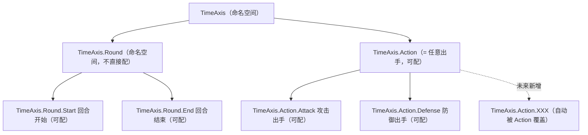
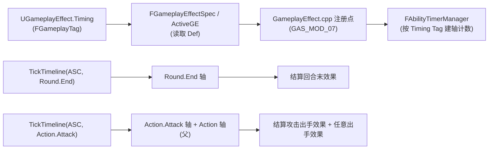

# GameplayAbilities 回合制与多时间轴改造方案与实施结果

> 本文档既记录改造**方案**，也记录**实际实施结果**。参考开源项目
> [BinaryBard996/TurnBasedSample](https://github.com/BinaryBard996/TurnBasedSample)
> 及其[博客说明](https://binarybard996.github.io/BinaryBardBlog/posts/turn-based-gas/)。
>
> - 引擎基线：UE **5.8**（参考方案原针对 5.6/5.7，实施时已做 API 适配）
> - 项目插件：`GameWork/Plugins/GameplayAbilities`
> - 状态：**已实施完成**（`GAS_MOD_05~13`），`GameWorkEditor Win64 Development` 构建 **Result: Succeeded**
> - 配套记录：`源码修改记录.md`（完整列出 `GAS_MOD_01~13` 的改动前/改动后）
>
> 改造分两个阶段 + 编译适配，本文按顺序记录：
>
> | 阶段 | 编号 | 内容 |
> |------|------|------|
> | **阶段一：回合制** | `GAS_MOD_05~09` | 把 GE 的 Duration/Period 从"秒"切换到"回合"（单一刻度） |
> | **阶段二：多时间轴** | `GAS_MOD_10~12` | 把单一刻度升级为"按时机（`TimeAxis.*` Tag）分轴"的多条时间轴 |
> | **编译适配** | `GAS_MOD_13` | 插件形式下的 `Internal` include 路径与委托执行适配 |

---

## 1. 背景与目标

### 1.1 问题

GAS 原生的 `GameplayEffect`（GE）在**持续时间、周期触发、冷却**等机制上，全部依赖
**世界时间驱动的 `FTimerManager`**（`GameplayEffect.cpp` 中通过 `SetTimer` 注册）：

| 机制 | 原生实现 | 回合制期望 |
|------|---------|-----------|
| Duration（持续时间） | 注册秒数 Timer，到期移除 GE | 持续 N **个回合** |
| Period（周期触发） | Looping Timer，按秒间隔重复 | 每 N **个回合**触发一次 |
| Cooldown（冷却） | 本质是带 Duration 的 GE | 冷却 N **个回合** |

回合制游戏需要这些效果基于**回合数**而非秒数推进。

进一步地，只用一个"回合刻度"仍不够：**"回合"与"出手次数"是两种不同口径**，挤在同一个计数器里会互相干扰，也无法细分"回合开始/结束""攻击/防御出手"等具体时机：

```cpp
// 单一刻度的问题（阶段一的实现）
struct FAbilityTimerContainer
{
    int32 Turn = 0;                     // 1 代表什么由调用方决定
    TArray<FTimerHandle> TimerHandles;
};
```

- 无法区分"回合 / 出手次数"两种口径，同一 ASC 上的两类效果会**互相干扰**；
- 无法细分"回合开始 / 回合结束""攻击出手 / 防御出手"等**具体时机**；
- 无法表达"任意出手（含未来新增类型）"这类**聚合语义**。

### 1.2 目标（阶段一：回合制）

1. 让 `Duration`、`Period`、`Cooldown` 的**时间单位从"秒"切换为"回合"**；
2. 通过**手动调用** `TickTurn`（现行 `TickTimeline`）作为回合推进的唯一入口；
3. **不改动 GE 的配置方式**（资产配置方式与实时制完全一致，仅语义变化）；
4. 支持**即时制 ↔ 回合制运行时动态切换**，保留 GAS 原有全部功能；
5. 所有改动沿用项目既有 **`GAS_MOD_xx` + 装饰线包裹** 标记规范（模板见 `源码修改记录.md`）。

### 1.3 目标（阶段二：多时间轴）

1. 引入**时机（Timing）**概念：回合开始/结束、攻击/防御出手等；
2. 用 `FGameplayTag` **层级**表达时机，父标签天然聚合子标签（"任意出手"自动含未来类型）；
3. 一个 ASC 可**同时维护多个时机的计数器**，各自独立推进；
4. GE 在资产上声明自己挂在**哪个时机**；
5. 回合类效果**每回合只结算一次**（不因开始/结束而重复）；
6. 对现有"只用回合"的用法**零影响**（默认时机 = `TimeAxis.Round.End`）；
7. 沿用 `GAS_MOD_xx` 标记规范，编号自 `GAS_MOD_10` 顺延。

---

## 2. 参考方案概述（TurnBasedSample）

参考方案核心思路：**用自定义的回合 Timer 管理器，替换 GE 中使用的实时 Timer**。

| 部分 | 内容 |
|------|------|
| 1. 新增 `FAbilityTimerManager` | 继承 `FTimerManager`，为每个 ASC 维护一个计时容器 |
| 2. 修改 `AbilitySystemGlobals` | 全局持有并管理 `AbilityTimerManager` |
| 3. 修改 `AbilitySystemComponent` | 新增 `bTurnBased` 回合开关 |
| 4. 修改 `GameplayEffect.cpp` | 改 Duration Timer、Period Timer 为回合驱动 |
| 5. 修改 `AbilitySystemBlueprintLibrary` | 新增蓝图可调用的回合推进入口（`TickTurn` → 现行 `TickTimeline`） |

> 参考实现用注释 `// TurnBased Support` / `// ~TurnBased Support` 标记改动；
> **本项目改用既有的 `GAS_MOD_xx` 规范标记**（阶段一 `GAS_MOD_05~09`，阶段二 `GAS_MOD_10~12`）。

---

## 3. 改造前插件现状

- 本项目 `GameplayAbilities` 是 UE 5.8 引擎源码的拷贝。
- 改造前**无任何回合制代码**（`TickTurn`/`bTurnBased`/`FAbilityTimerManager` 等均不存在）。
- 改造前已有 4 处无关定制改动：

| 标记 | 文件 | 内容 |
|------|------|------|
| `GAS_MOD_01` | GameplayEffect.cpp | GameplayCue N*N 重复触发修复（OnActive/WhileActive） |
| `GAS_MOD_02` | GameplayEffect.cpp | GameplayCue N*N 重复触发修复（Removed） |
| `GAS_MOD_03` | GameplayEffect.cpp | StackOverflow 边界判定修复 |
| `GAS_MOD_04` | AbilitySystemBlueprintLibrary.cpp | PRAGMA 屏蔽 UE5.8 弃用告警 |

**关键落点（改造位置）**：

| 位置 | 文件 | 说明 |
|------|------|------|
| Duration Timer | `GameplayEffect.cpp` | `TimerManager.SetTimer(DurationHandle, ..., FinalDuration, false)` |
| Period Timer | `GameplayEffect.cpp` | `TimerManager.SetTimer(PeriodHandle, ..., GetPeriod(), true)` |
| Period 抑制重置 | `GameplayEffect.cpp` | `PeriodicInhibitionPolicy` 分支下的 Period Timer 重注册 |
| Timer 清理 | `GameplayEffect.cpp` | GE 移除 / `Uninitialize` 时的 `ClearTimer(DurationHandle/PeriodHandle)` |
| `CheckDuration` | `GameplayEffect.cpp` | 到期判定 + `RefreshDurationTimer` + `CheckForFinalPeriodicExec` |
| 全局单例 | `AbilitySystemGlobals.h/.cpp` | 标准 `UAbilitySystemGlobals` 单例 |

---

## 4. 阶段一：回合制改造（`GAS_MOD_05~09`）

### 4.0 标记与编号（实际）

沿用既有规范（装饰线 + `START`/`END` + `/* */` 修改前对照）。实际落地的编号：

| 编号 | 位置 | 内容 |
|------|------|------|
| `GAS_MOD_05` | `AbilitySystemGlobals.h/.cpp` | 全局持有/销毁 `FAbilityTimerManager` + `FinishDestroy` 清理 |
| `GAS_MOD_06` | `AbilitySystemComponent.h` | 新增 `bTurnBased` 回合开关 + `IsTurnBased`/`SetTurnBasedEnabled` |
| `GAS_MOD_07` | `GameplayEffect.cpp` | Timer 回合化（拆分为 `07a~07h`，见 4.4）；阶段二追加按 `Timing` 路由 |
| `GAS_MOD_08` | `AbilitySystemBlueprintLibrary.h/.cpp` | 新增蓝图 `TickTurn`（**已移除**，由 `GAS_MOD_12` 的 `TickTimeline` 取代） |
| `GAS_MOD_09` | `AbilityTimerManager.h/.cpp` | **新增文件**（时间轴 Timer 管理器，整体用 `START/END` 包裹；阶段二的多轴扩展并入本编号） |

> 说明：改造中还包含 include 语句的标记（`GAS_MOD_07` / `GAS_MOD_12`）。

### 4.1 新增 `FAbilityTimerManager`（`GAS_MOD_09` 初版形态）

> 下方为阶段一的**初版单刻度形态**；阶段二已升级为多轴版（见 5.5）。

**文件**：`Public/AbilityTimerManager.h` + `Private/AbilityTimerManager.cpp`（新增，整体为 `GAS_MOD_09`）

```cpp
// 每个 ASC 的计时容器
struct FAbilityTimerContainer
{
    int32 Turn = 0;                       // 当前回合数
    TArray<FTimerHandle> TimerHandles;    // 该 ASC 下所有按回合推进的 Timer
};

// 回合 Timer 管理器：继承实时 FTimerManager，叠加"回合驱动"能力
class FAbilityTimerManager : public FTimerManager
{
public:
    FAbilityTimerManager() : FTimerManager(nullptr) {}

    // 推进某 ASC 的回合（Delta 步进），并触发到期的回合 Timer
    void TickTurn(UAbilitySystemComponent* ASC, int32 Delta = 1);

    // 替代 FTimerManager::SetTimer —— 把 Timer 注册进回合容器（Rate 语义为回合数）
    void SetAbilityTimer(UAbilitySystemComponent* ASC, FTimerHandle& OutHandle,
                         const FTimerDelegate& InDelegate, float InRate, bool bInLoop,
                         float InFirstDelay = -1.f);

    // 查询某 Timer 剩余回合数
    float GetAbilityTimerRemaining(UAbilitySystemComponent* ASC, FTimerHandle& InHandle);

    // 查询某 ASC 当前回合数
    int32 GetAbilityCurrentTurn(UAbilitySystemComponent* ASC) const;

    // 从回合容器中移除某 Timer（通常需配合 ClearTimer）
    void RemoveAbilityTimer(UAbilitySystemComponent* ASC, FTimerHandle& InHandle);

private:
    TMap<TWeakObjectPtr<UAbilitySystemComponent>, FAbilityTimerContainer> AbilityTimerContainers;
    FAbilityTimerContainer& GetAbilityTimerContainer(UAbilitySystemComponent* ASC);
};
```

**`TickTurn` 实现**（回合推进，等价于实时版 `FTimerManager::Tick`）：

```cpp
void FAbilityTimerManager::TickTurn(UAbilitySystemComponent* ASC, int32 Delta)
{
    if (!ASC) return;

    FAbilityTimerContainer& Container = GetAbilityTimerContainer(ASC);
    for (int32 Step = 0; Step < Delta; ++Step)
    {
        Container.Turn++;                        // 当前回合统一由容器维护

        TArray<FTimerHandle> ToRemove;           // 先收集，避免边遍历边删除
        for (FTimerHandle& Handle : Container.TimerHandles)
        {
            FTimerData* Data = FindTimer(Handle);
            if (!Data) { ToRemove.Emplace(Handle); continue; }

            if (Data->ExpireTime <= static_cast<double>(Container.Turn))   // 到期
            {
                Data->TimerDelegate.Execute();   // 执行 Duration 到期 / Period 触发回调
                if (Data->bLoop)
                    Data->ExpireTime = static_cast<double>(Container.Turn) + static_cast<double>(Data->Rate);
                else
                    ToRemove.Emplace(Handle);    // 一次性：移除
            }
        }
        for (FTimerHandle& Handle : ToRemove)
        {
            RemoveAbilityTimer(ASC, Handle);
            ClearTimer(Handle);
        }
    }
}
```

**`SetAbilityTimer` 实现**（复用父类 `SetTimer` 注册，再把 `ExpireTime` 改写为回合语义）：

```cpp
void FAbilityTimerManager::SetAbilityTimer(UAbilitySystemComponent* ASC, FTimerHandle& OutHandle,
    const FTimerDelegate& InDelegate, float InRate, bool bInLoop, float InFirstDelay)
{
    if (!ASC) return;

    ClearTimer(OutHandle);                 // 先清理旧 Timer（父类 + 回合容器）
    RemoveAbilityTimer(ASC, OutHandle);

    if (InRate > 0.f)
    {
        SetTimer(OutHandle, InDelegate, InRate, bInLoop, InFirstDelay);   // 复用父类注册
        if (OutHandle.IsValid())
        {
            if (FTimerData* Data = FindTimer(OutHandle))
            {
                FAbilityTimerContainer& Container = GetAbilityTimerContainer(ASC);
                const float ActualFirstDelay = (InFirstDelay >= 0.f) ? InFirstDelay : InRate;
                // 关键：把父类写入的"秒"语义改写为"回合"语义
                Data->ExpireTime = static_cast<double>(Container.Turn) + static_cast<double>(ActualFirstDelay);
                Container.TimerHandles.AddUnique(OutHandle);
            }
        }
    }
}
```

**要点**：
- `Duration` 语义为 `ExpireTime = 起始刻度 + Rate`；`Period` 用 `bLoop=true` 每 `Rate` 个刻度触发一次。
- 管理器**不调用父类 `Tick`**（不随世界时间走），各轴 Timer 完全由 `TickTimeline` 按刻度驱动。
- `FindTimer` 是父类 `FTimerManager` 的 `protected` 方法，子类可访问，用于读写 `ExpireTime`/`bLoop`/`Rate`。
- UE 5.8 中 `FTimerData::ExpireTime` 为 `double`，`SetTimer` 会先按秒写入，随后被覆盖为刻度值。

### 4.2 `AbilitySystemGlobals`（`GAS_MOD_05`）

全局单例式访问与生命周期清理：

```cpp
// AbilitySystemGlobals.h（public）
FAbilityTimerManager& GetAbilityTimerManager();     // 懒加载创建
void DestroyAbilityTimerManager();                  // 销毁并释放
virtual void FinishDestroy() override;              // UObject 销毁前清理
// private
FAbilityTimerManager* AbilityTimerManager = nullptr;
```

```cpp
// AbilitySystemGlobals.cpp
FAbilityTimerManager& UAbilitySystemGlobals::GetAbilityTimerManager()
{
    if (!AbilityTimerManager) { AbilityTimerManager = new FAbilityTimerManager(); }
    return *AbilityTimerManager;
}
void UAbilitySystemGlobals::FinishDestroy()
{
    DestroyAbilityTimerManager();   // 防止泄漏
    Super::FinishDestroy();
}
```

### 4.3 `AbilitySystemComponent`（`GAS_MOD_06`）

```cpp
// AbilitySystemComponent.h（public）
UPROPERTY(EditAnywhere, Category = "TurnBased")
bool bTurnBased = false;                          // 是否回合制（默认关闭，保持原行为）

UFUNCTION(BlueprintCallable, Category = "TurnBased")
bool IsTurnBased() const { return bTurnBased; }

UFUNCTION(BlueprintCallable, Category = "TurnBased")
void SetTurnBasedEnabled(bool bEnabled = false) { bTurnBased = bEnabled; }
```

**要点**：`bTurnBased` 仅作为"该 ASC 是否回合制"的开关。刻度统一由 `FAbilityTimerManager` 内部的各时机轴（`FAbilityTimerAxis::Counter`）维护（现行通过 `GetTimelineCounter(ASC, Timing)` 查询），ASC 上**不再冗余保存** `CurrentTurn`，避免两份计数不一致。

### 4.4 `GameplayEffect.cpp`（`GAS_MOD_07`，拆分 `07a~07h`）

所有 Timer 的**注册、到期判定、清理**均按 `Owner->IsTurnBased()` 分支：

| 子标记 | 位置 | 改动 |
|--------|------|------|
| `07a` | `AddActiveGameplayEffectGrantedTagsAndModifiers` 的 Duration 注册 | 回合制改用 `SetAbilityTimer`（Duration=刻度）；兜底分支回合制下改为 1 个刻度后触发 |
| `07b` | 同函数的 Period 注册 | 回合制改用 `SetAbilityTimer`（Period=刻度）；"应用即触发"改为直接 `Delegate.ExecuteIfBound()` |
| `07c` | `CheckDuration` 到期判定 | 抽出 `bDurationExpired`；回合制下本回调由 `TickTimeline` 精确触发，直接按"已到期"处理，跳过世界时间二次校验 |
| `07d` | `CheckDuration` 的 `RefreshDurationTimer` | 回合制下改用 `SetAbilityTimer` 按**刻度**重新注册 |
| `07e` | Period 抑制重置（`PeriodicInhibitionPolicy`） | 回合制改用 `SetAbilityTimer`；`ExecuteAndResetPeriod` 改为直接执行 delegate |
| `07f` | `RemoveActiveGameplayEffect` 的 Timer 清理 | 回合制下清理 `FAbilityTimerManager`（`RemoveAbilityTimer` + `ClearTimer`） |
| `07g` | `Uninitialize` 的 Timer 清理 | 回合制下清理 `FAbilityTimerManager` |
| `07h` | `CheckDuration` 的 `CheckForFinalPeriodicExec` | 回合制下用 `FAbilityTimerManager` 判断/清理 PeriodHandle |

> 阶段二在此之上追加：`07a~07h` 各调用点均先从 GE 读取 `Timing`（未配置默认 `TimeAxis.Round.End`）再传入
> `SetAbilityTimer` / `GetAbilityTimerRemaining` / `RemoveAbilityTimer`（该部分并入 `GAS_MOD_07`，见 5.8）。

#### (a) Duration Timer 注册（`07a`）

```cpp
FTimerDelegate Delegate = FTimerDelegate::CreateUObject(Owner, &UAbilitySystemComponent::CheckDurationExpired, AppliedActiveGE->Handle);

// 读取该 GE 所属的时机（未配置时默认 TimeAxis.Round.End）
const FGameplayTag Timing = AbilityTimingTags::ResolveOrDefault(AppliedEffectSpec.Def ? AppliedEffectSpec.Def->Timing : FGameplayTag());

if (!Owner->IsTurnBased())
{
    FTimerManager& TimerManager = Owner->GetWorld()->GetTimerManager();
    TimerManager.SetTimer(AppliedActiveGE->DurationHandle, Delegate, FinalDuration, false);
}
else
{
    FAbilityTimerManager& AbilityTimerManager = UAbilitySystemGlobals::Get().GetAbilityTimerManager();
    AbilityTimerManager.SetAbilityTimer(Owner, Timing, AppliedActiveGE->DurationHandle, Delegate, FinalDuration, false);
}
// 兜底：DurationHandle 无效时，实时制下一帧触发 / 回合制 1 个刻度后触发
if (!ensureMsgf(AppliedActiveGE->DurationHandle.IsValid(), ...))
{
    if (!Owner->IsTurnBased()) { Owner->GetWorld()->GetTimerManager().SetTimerForNextTick(Delegate); }
    else { UAbilitySystemGlobals::Get().GetAbilityTimerManager().SetAbilityTimer(Owner, Timing, AppliedActiveGE->DurationHandle, Delegate, 1.f, false); }
}
```

#### (b) Period Timer 注册（`07b`）

```cpp
FTimerDelegate Delegate = FTimerDelegate::CreateUObject(Owner, &UAbilitySystemComponent::ExecutePeriodicEffect, AppliedActiveGE->Handle);

// 读取该 GE 所属的时机（未配置时默认 TimeAxis.Round.End）
const FGameplayTag Timing = AbilityTimingTags::ResolveOrDefault(AppliedEffectSpec.Def ? AppliedEffectSpec.Def->Timing : FGameplayTag());

if (!Owner->IsTurnBased())
{
    FTimerManager& TimerManager = Owner->GetWorld()->GetTimerManager();
    if (AppliedEffectSpec.Def->bExecutePeriodicEffectOnApplication)
        TimerManager.SetTimerForNextTick(Delegate);
    TimerManager.SetTimer(AppliedActiveGE->PeriodHandle, Delegate, AppliedEffectSpec.GetPeriod(), true);
}
else
{
    FAbilityTimerManager& AbilityTimerManager = UAbilitySystemGlobals::Get().GetAbilityTimerManager();
    // 回合制下无"下一帧"概念，"应用时立即执行一次"改为直接执行 delegate
    if (AppliedEffectSpec.Def->bExecutePeriodicEffectOnApplication)
        Delegate.ExecuteIfBound();
    AbilityTimerManager.SetAbilityTimer(Owner, Timing, AppliedActiveGE->PeriodHandle, Delegate, AppliedEffectSpec.GetPeriod(), true);
}
```

#### (c) Timer 清理（`07f` / `07g`）

回合制下 `DurationHandle`/`PeriodHandle` 注册在 `FAbilityTimerManager`（独立实例），**不能**用 `World->GetTimerManager().ClearTimer()` 清理，否则清错管理器、残留句柄：

```cpp
if (Effect.DurationHandle.IsValid())
{
    if (!Owner->IsTurnBased()) { World->GetTimerManager().ClearTimer(Effect.DurationHandle); }
    else
    {
        FAbilityTimerManager& AbilityTimerManager = UAbilitySystemGlobals::Get().GetAbilityTimerManager();
        AbilityTimerManager.RemoveAbilityTimer(Owner, Timing, Effect.DurationHandle);
        AbilityTimerManager.ClearTimer(Effect.DurationHandle);
    }
}
// PeriodHandle 同理
```

> **关于 `GetTimeRemaining`**：本次改造**未修改** `FActiveGameplayEffect::GetTimeRemaining`。
> 回合制下 Duration 到期由 `DurationHandle` 的回合 Timer 精确驱动（`07a`）+ `CheckDuration`（`07c`）判定，
> 不依赖 `GetTimeRemaining`；该函数仅在 Stack 叠加 carryover 等边缘场景用到，暂保持引擎原样。

### 4.5 `AbilitySystemBlueprintLibrary`（`GAS_MOD_08`，已被 `GAS_MOD_12` 取代）

> ⚠️ 该蓝图入口 `TickTurn` 已在 `GAS_MOD_12` 中改为 `TickTimeline(ASC, Timing, Delta)`（不保留兼容封装）。下方为历史记录。

原蓝图入口，作为回合推进的唯一外部接口：

```cpp
// AbilitySystemBlueprintLibrary.h
UFUNCTION(BlueprintCallable, Category = "Ability|TurnBased")
static void TickTurn(UAbilitySystemComponent* AbilitySystemComponent, int32 Delta = 1);

// AbilitySystemBlueprintLibrary.cpp
void UAbilitySystemBlueprintLibrary::TickTurn(UAbilitySystemComponent* AbilitySystemComponent, int32 Delta)
{
    if (!AbilitySystemComponent) return;
    UAbilitySystemGlobals::Get().GetAbilityTimerManager().TickTurn(AbilitySystemComponent, Delta);
}
```

> 现行实现见 5.9（`GAS_MOD_12` 的 `TickTimeline`）。

---

## 5. 阶段二：多时间轴（时机 Tag）改造（`GAS_MOD_10~12`）

### 5.1 核心概念：时间轴 + 时机（Tag 层级）

**"回合"与"出手次数"是两条时间轴**；每条轴下又细分**时机**。用 Tag 层级统一表达：

> **命名取向**：`Round`（全体一轮）⊃ `Action`（单个单位的一次出手）。
> 即"一个回合"= 全体各出手一次，"出手"= 某单位的一次行动，二者层级不重叠。
> 不用 `Turn` 表示"回合"，因 `Turn` 在业界惯例中常指"**单个单位的一次行动**"，会与 `Action` 语义撞车。



**关键语义（已确认）：**

| 约定 | 说明 |
|------|------|
| `TimeAxis.Round` **不作 GE 可配值** | 配了会被 Start + End 各推一次 = 一回合 2 次，**违反"每回合一次"** |
| 回合类只配叶子 | `TimeAxis.Round.Start` 或 `TimeAxis.Round.End`，**各自每回合一次** |
| `TimeAxis.Action` **兼作"任意出手"** | 可配；`MatchesTag` 自动覆盖 `Action.Attack`/`Action.Defense` 及**未来新增**的 `Action.*` |

### 5.2 设计决策

| 项 | 决策 |
|----|------|
| 时机标识形式 | **`FGameplayTag`**（层级天然支持聚合，替代枚举） |
| 配置位置 | **GE 上**（与 `DurationPolicy` 同层，作为 GE 的时间语义） |
| 计数器位置 | `FAbilityTimerManager`（每条已注册时机一个计数，单一数据源） |
| 推进方式 | `TickTimeline(ASC, 具体时机Tag, Delta)` → 推进**所有被匹配的轴（含父级）** |
| 实时制 | 由 `bTurnBased=false` 走原世界 `FTimerManager`（与本次改造正交） |

### 5.3 原生时机 Tag：`AbilityTimingTags`（`GAS_MOD_10`，新增文件）

**文件**：`Public/AbilityTimingTags.h` + `Private/AbilityTimingTags.cpp`（全新文件）

用原生 GameplayTag 声明与注册，模块加载时自动注册、卸载时自动注销（无需写入 `DefaultGameplayTags.ini`）：

```cpp
// AbilityTimingTags.h
namespace AbilityTimingTags
{
    // ========================================================================
    //  Round Tags（TimeAxis.Round.*）
    // ========================================================================
    GAMEPLAYABILITIES_API UE_DECLARE_GAMEPLAY_TAG_EXTERN(TAG_TIMEAXIS_ROUND);
    GAMEPLAYABILITIES_API UE_DECLARE_GAMEPLAY_TAG_EXTERN(TAG_TIMEAXIS_ROUND_START);
    GAMEPLAYABILITIES_API UE_DECLARE_GAMEPLAY_TAG_EXTERN(TAG_TIMEAXIS_ROUND_END);

    // ========================================================================
    //  Action Tags（TimeAxis.Action.*）
    // ========================================================================
    GAMEPLAYABILITIES_API UE_DECLARE_GAMEPLAY_TAG_EXTERN(TAG_TIMEAXIS_ACTION);
    GAMEPLAYABILITIES_API UE_DECLARE_GAMEPLAY_TAG_EXTERN(TAG_TIMEAXIS_ACTION_ATTACK);
    GAMEPLAYABILITIES_API UE_DECLARE_GAMEPLAY_TAG_EXTERN(TAG_TIMEAXIS_ACTION_DEFENSE);

    /** 无效（未配置）时回落到默认时机 TimeAxis.Round.End */
    inline FGameplayTag ResolveOrDefault(const FGameplayTag& InTiming)
    {
        return InTiming.IsValid() ? InTiming : TAG_TIMEAXIS_ROUND_END.GetTag();
    }
}
```

```cpp
// AbilityTimingTags.cpp —— 注册
namespace AbilityTimingTags
{
    UE_DEFINE_GAMEPLAY_TAG_COMMENT(TAG_TIMEAXIS_ROUND,          "TimeAxis.Round",          "全体一轮（命名空间，不作为 GE 的 Timing 使用）");
    UE_DEFINE_GAMEPLAY_TAG_COMMENT(TAG_TIMEAXIS_ROUND_START,    "TimeAxis.Round.Start",    "回合开始");
    UE_DEFINE_GAMEPLAY_TAG_COMMENT(TAG_TIMEAXIS_ROUND_END,      "TimeAxis.Round.End",      "回合结束（默认时机）");
    UE_DEFINE_GAMEPLAY_TAG_COMMENT(TAG_TIMEAXIS_ACTION,         "TimeAxis.Action",         "任意出手（父标签，含未来新增 Action.*）");
    UE_DEFINE_GAMEPLAY_TAG_COMMENT(TAG_TIMEAXIS_ACTION_ATTACK,  "TimeAxis.Action.Attack",  "攻击出手");
    UE_DEFINE_GAMEPLAY_TAG_COMMENT(TAG_TIMEAXIS_ACTION_DEFENSE, "TimeAxis.Action.Defense", "防御出手");
}
```

### 5.4 GE 上声明 `Timing`（`GAS_MOD_11`）

**位置**：`Public/GameplayEffect.h`，`UGameplayEffect` 的 `DurationPolicy` 之后

**修改前（引擎原版）**：无该字段，GE 的 `Duration`/`Period` 一律按世界时间（秒）驱动。

**修改后（本项目）**：

```cpp
/** Policy for the duration of this effect */
UPROPERTY(EditDefaultsOnly, Category=Duration)
EGameplayEffectDurationType DurationPolicy;

// 该 GE 的 Duration/Period 挂在哪个时机上（仅回合制模式下生效）
// 留空 = 默认 TimeAxis.Round.End；回合类配 TimeAxis.Round.Start / TimeAxis.Round.End；
// 出手类配 TimeAxis.Action 或 TimeAxis.Action.Attack / Action.Defense。
UPROPERTY(EditDefaultsOnly, Category = Duration,
          meta = (Categories = "TimeAxis",
                  EditCondition = "DurationPolicy != EGameplayEffectDurationType::Instant", EditConditionHides))
FGameplayTag Timing;
```

> 默认值走 `AbilityTimingTags::ResolveOrDefault()` 在注册点回落，避免 CDO 构造期原生 Tag 尚未注册的问题。

### 5.5 `FAbilityTimerManager` 升级为多轴（并入 `GAS_MOD_09`）

**文件**：`Public/AbilityTimerManager.h` + `Private/AbilityTimerManager.cpp`

**修改前（阶段一单刻度版）**：

```cpp
struct FAbilityTimerContainer
{
    int32 Turn = 0;                     // 单一匿名刻度
    TArray<FTimerHandle> TimerHandles;
};
void TickTurn(ASC, Delta);
void SetAbilityTimer(ASC, FTimerHandle&, Delegate, Rate, bLoop, FirstDelay);
float GetAbilityTimerRemaining(ASC, FTimerHandle&);
int32 GetAbilityCurrentTurn(ASC) const;
void RemoveAbilityTimer(ASC, FTimerHandle&);
```

**修改后（本项目多轴版）**：

```cpp
/** 某条时间轴（某个"时机"）的运行状态 */
struct FAbilityTimerAxis
{
    int32 Counter = 0;                    // 该时机已推进的刻度
    TArray<FTimerHandle> TimerHandles;    // 挂在该时机上的 Timer
};

/** 每个 ASC 的计时容器：按时机 Tag 分组，各轴独立推进 */
struct FAbilityTimerContainer
{
    TMap<FGameplayTag, FAbilityTimerAxis> Axes;
};

class FAbilityTimerManager : public FTimerManager
{
public:
    FAbilityTimerManager() : FTimerManager(nullptr) {}

    /** 推进某 ASC 的指定时机（Delta 步进），命中所有匹配轴（含父级聚合） */
    void TickTimeline(UAbilitySystemComponent* ASC, FGameplayTag InTiming, int32 Delta = 1);   // 取代 TickTurn

    /** 注册 Timer 到指定时机（Rate 语义为该时机刻度数） */
    void SetAbilityTimer(UAbilitySystemComponent* ASC, FGameplayTag InTiming, FTimerHandle& OutHandle,
                         const FTimerDelegate& InDelegate, float InRate, bool bInLoop, float InFirstDelay = -1.f);

    /** 查询某 Timer 在指定时机上的剩余刻度 */
    float GetAbilityTimerRemaining(UAbilitySystemComponent* ASC, FGameplayTag InTiming, FTimerHandle& InHandle);

    /** 查询某 ASC 指定时机当前的刻度 */
    int32 GetTimelineCounter(UAbilitySystemComponent* ASC, FGameplayTag InTiming) const;      // 取代 GetAbilityCurrentTurn

    /** 从指定时机移除某 Timer（不清理 FTimerManager 内部数据，通常需配合 ClearTimer） */
    void RemoveAbilityTimer(UAbilitySystemComponent* ASC, FGameplayTag InTiming, FTimerHandle& InHandle);

private:
    TMap<TWeakObjectPtr<UAbilitySystemComponent>, FAbilityTimerContainer> AbilityTimerContainers;
    FAbilityTimerContainer& GetAbilityTimerContainer(UAbilitySystemComponent* ASC);
    FAbilityTimerAxis& GetAbilityTimerAxis(UAbilitySystemComponent* ASC, FGameplayTag InTiming);
    void RemoveAbilityTimerByHandle(UAbilitySystemComponent* ASC, FTimerHandle& InHandle);
};
```

### 5.6 `TickTimeline` 实现（推进所有匹配轴）

> 下方为设计稿；**实际实现**（`Private/AbilityTimerManager.cpp`）在此基础上增加了稳健性处理：
> 推进前快照"命中的轴 Tag 与句柄数组"（避免回调移除 GE 导致迭代器失效）、
> 执行前快照 `bLoop` / `Rate`（避免回调清除 Timer 后访问失效的 `FTimerData`），
> 并对无效 / 命名空间 `Timing` 输出警告。

```cpp
void FAbilityTimerManager::TickTimeline(UAbilitySystemComponent* ASC, FGameplayTag InTiming, int32 Delta)
{
    if (!ASC || !InTiming.IsValid()) return;

    FAbilityTimerContainer& Container = GetAbilityTimerContainer(ASC);

    // 推进所有"被 InTiming 命中"的轴（InTiming 是已注册轴 AxisTag 的子/相等标签）：
    //   InTiming = Round.End      → 命中 Round.End
    //   InTiming = Action.Attack  → 命中 Action.Attack、Action（任意出手）
    for (TPair<FGameplayTag, FAbilityTimerAxis>& Pair : Container.Axes)
    {
        const FGameplayTag AxisTag = Pair.Key;
        FAbilityTimerAxis& AxisData = Pair.Value;

        if (!InTiming.MatchesTag(AxisTag)) continue;   // 该轴与本次推进无关

        for (int32 Step = 0; Step < Delta; ++Step)
        {
            AxisData.Counter++;

            TArray<FTimerHandle> ToRemove;
            for (FTimerHandle& Handle : AxisData.TimerHandles)
            {
                FTimerData* Data = FindTimer(Handle);
                if (!Data) { ToRemove.Emplace(Handle); continue; }

                if (Data->ExpireTime <= static_cast<double>(AxisData.Counter))
                {
                    const bool bLoop = Data->bLoop;      // 执行前快照
                    const float Rate = Data->Rate;
                    Data->TimerDelegate.Execute();

                    if (bLoop)
                        Data->ExpireTime = static_cast<double>(AxisData.Counter) + static_cast<double>(Rate);
                    else
                        ToRemove.Emplace(Handle);
                }
            }
            for (FTimerHandle& Handle : ToRemove)
            {
                RemoveAbilityTimer(ASC, AxisTag, Handle);
                ClearTimer(Handle);
            }
        }
    }
}
```

### 5.7 数据流



### 5.8 编号与调用点改造

| 编号 | 文件 | 内容 |
|------|------|------|
| `GAS_MOD_10` | `AbilityTimingTags.h/.cpp`（新增） | 声明/注册原生时机 Tag（`TimeAxis.Round.Start/End`、`TimeAxis.Action[.Attack/.Defense]`） |
| `GAS_MOD_11` | `GameplayEffect.h` | `UGameplayEffect` 新增 `FGameplayTag Timing` 字段 |
| `GAS_MOD_12` | `AbilitySystemBlueprintLibrary.h/.cpp` | 蓝图入口由 `TickTurn`（`GAS_MOD_08`）替换为 `TickTimeline(ASC, Timing, Delta = 1)` |
| `GAS_MOD_09`（扩展） | `AbilityTimerManager.h/.cpp` | 多轴化（`FAbilityTimerAxis` / `TickTimeline`），移除 `TickTurn` |
| `GAS_MOD_07`（扩展） | `GameplayEffect.cpp` | `07a~07h` 调用点按 `Timing` 路由 |

> 后两项并入既有编号（同一文件保持单一标记），不另占编号。

**注册点改造（`GAS_MOD_07`，对应 `07a`）**：

```cpp
if (!Owner->IsTurnBased())
{
    FTimerManager& TimerManager = Owner->GetWorld()->GetTimerManager();
    TimerManager.SetTimer(AppliedActiveGE->DurationHandle, Delegate, FinalDuration, false);
}
else
{
    FAbilityTimerManager& AbilityTimerManager = UAbilitySystemGlobals::Get().GetAbilityTimerManager();
    const FGameplayTag Timing = AbilityTimingTags::ResolveOrDefault(AppliedActiveGE->Spec.Def->Timing);   // 从 GE 读取时机
    AbilityTimerManager.SetAbilityTimer(Owner, Timing, AppliedActiveGE->DurationHandle, Delegate, FinalDuration, false);
}
```

> `07b/07d/07e` 同理带 `Timing`；`07c/07h` 的 `GetAbilityTimerRemaining` 与 `07f/07g` 的 `RemoveAbilityTimer` 也传入对应 `Timing`
> （`RemoveAbilityTimer` 在指定轴找不到句柄时会退化为遍历全部轴按句柄查找）。

### 5.9 蓝图入口（`GAS_MOD_12`）

```cpp
// AbilitySystemBlueprintLibrary.h
UFUNCTION(BlueprintCallable, Category = "Ability|TurnBased")
static UE_API void TickTimeline(UAbilitySystemComponent* AbilitySystemComponent, FGameplayTag Timing, int32 Delta = 1);

// AbilitySystemBlueprintLibrary.cpp
void UAbilitySystemBlueprintLibrary::TickTimeline(UAbilitySystemComponent* AbilitySystemComponent, FGameplayTag Timing, int32 Delta)
{
    if (!AbilitySystemComponent)
    {
        return;
    }

    UAbilitySystemGlobals::Get().GetAbilityTimerManager().TickTimeline(AbilitySystemComponent, Timing, Delta);
}
```

---

## 6. 使用方式（玩法侧）

### 6.1 开关与 GE 配置

1. 在 ASC 默认属性中把 `bTurnBased` 勾选为 `true`（或用 `SetTurnBasedEnabled(true)`）。
2. GE 资产照常配置，语义变为（`Duration = 1.0` → 持续 1 个刻度；`Period = 2.0` → 每 2 个刻度触发一次），并按需指定 `Timing`：

| 需求 | GE 的 `Timing` | 结算频率 |
|------|---------------|---------|
| 持续 N 回合的 Buff/Debuff（回合末递减） | `TimeAxis.Round.End` | 每回合 1 次 |
| 回合开始时触发（回合初回血等） | `TimeAxis.Round.Start` | 每回合 1 次 |
| 每 N 次**任意**出手触发（含未来类型） | `TimeAxis.Action` | 每次出手 1 次 |
| 仅攻击出手后触发 | `TimeAxis.Action.Attack` | 仅攻击时 |
| 仅防御出手后触发 | `TimeAxis.Action.Defense` | 仅防御时 |

3. 需要时可用 `SetTurnBasedEnabled(false)` 切回实时制（探索态实时、战斗态回合制）。

### 6.2 推进接口

```cpp
// 回合开始 / 回合结束
TickTimeline(ASC, AbilityTimingTags::TAG_TIMEAXIS_ROUND_START);
TickTimeline(ASC, AbilityTimingTags::TAG_TIMEAXIS_ROUND_END);
// 攻击出手 / 防御出手（同时命中父级 Action 轴）
TickTimeline(ASC, AbilityTimingTags::TAG_TIMEAXIS_ACTION_ATTACK);
TickTimeline(ASC, AbilityTimingTags::TAG_TIMEAXIS_ACTION_DEFENSE);

// 蓝图侧：UAbilitySystemBlueprintLibrary::TickTimeline(ASC, Timing, Delta)
```

**验证要点**：
- 配 `Round.End` 的 3 回合 Buff → 每次回合结束推 1 次，3 次到期 → 每回合一次 ✓
- 配 `Action` 的"每 2 次出手触发" → 攻击/防御出手都推 → 任意出手都算 ✓
- 未来新增 `Action.Move` → 配 `Action` 的效果自动被触发 → 含未来类型 ✓

---

## 7. 语义约定与保证

1. **每回合只一次**：回合类效果只配 `Round.Start` 或 `Round.End`（叶子），**禁止配** `TimeAxis.Round`。
   - 技术兜底：`SetAbilityTimer` 中若发现 `InTiming == TimeAxis.Round`（命名空间标签），输出 `UE_LOG` 警告。
2. **任意出手含未来**：靠 `Action` 父标签 + `MatchesTag` 机制自动覆盖未来 `Action.*`。
3. **默认时机**：`Timing` 未配置时回落到 `TimeAxis.Round.End`，未配置的 GE 行为与阶段一一致。

---

## 8. UE 5.8 适配记录（相对参考的 5.6/5.7）

| 关注点 | 实际处理 |
|--------|------|
| `FTimerManager` API | 复用父类 `SetTimer`/`ClearTimer`/`TimerExists`；`FindTimer` 为 `protected`，子类可直接访问 |
| `FTimerData::ExpireTime` | 5.8 中为 `double`，`SetAbilityTimer` 中按 `static_cast<double>` 写入该时机刻度值 |
| delegate 执行 | `FTimerUnifiedDelegate::Execute()` **未导出**（无 `ENGINE_API`，引擎内同 DLL 可直呼），插件跨 DLL 会 LNK2019；改为取内部 `VariantDelegate.TryGet<FTimerDelegate>()` 执行（`GAS_MOD_13`） |
| `Internal` 目录头 | `UObject/UObjectMigrationContext.h`（`CoreUObject/Internal`）、`SAddNewGameplayTagWidget.h`（`GameplayTagsEditor/Internal`）因 UBT 只对"引擎内部模块"暴露而不可见；两个 `*.Build.cs` 显式补 `PrivateIncludePaths`（C++ 源码保持与引擎原版一致）（`GAS_MOD_13`） |
| 原生 Tag | 用 `UE_DECLARE_GAMEPLAY_TAG_EXTERN` / `UE_DEFINE_GAMEPLAY_TAG_COMMENT`，模块加载时注册、卸载时注销 |
| 网络复制 | 各时机刻度由 `FAbilityTimerManager` 在权威端维护，不随 ASC 复制；客户端如需回合表现需另行同步 |
| 预测 | 回合制下预测路径（`bInvokePredictedEffects`）与实时 Timer 的交互需额外验证 |
| 与 `GAS_MOD_03` 的关系 | `GAS_MOD_03` 已修 StackOverflow；"Duration=刻度"仍复用原 Stack/Overflow 逻辑，二者不冲突 |

---

## 9. 兼容性与影响

- **默认时机 = `Round.End`**：现有 GE 行为与阶段一一致（若不显式配 `Timing`）。
- **旧 `TickTurn` 移除**：`GAS_MOD_09` 的 `TickTurn`（管理器接口）与 `GAS_MOD_08` 的蓝图入口不再保留兼容封装，
  统一由 `TickTimeline(ASC, TimeAxis.Round.End)` 取代，既有调用点需相应迁移。
- **`bTurnBased` 定位不变**：仍是"该 ASC 是否启用时机驱动"。
- **与既有 `GAS_MOD_01~04`**：Cue N*N 修复在 Cue 触发层、StackOverflow 修复在堆叠判定、PRAGMA 屏蔽在蓝图库，
  与 Timer 层改动**互不影响**；`GAS_MOD_04` 与 `GAS_MOD_12` 同在 `AbilitySystemBlueprintLibrary.cpp` 但位置不同，**可共存**。
- **编号沿用**：新增改动自 `GAS_MOD_05` 起编号；多时间轴阶段使用 `GAS_MOD_10~12`，两处扩展并入 `GAS_MOD_09` / `GAS_MOD_07`。

---

## 10. 实施步骤与结果

### 10.1 阶段一（回合制，`GAS_MOD_05~09`）

1. ✅ 新增 `AbilityTimerManager.h/.cpp`（`FAbilityTimerContainer`、`FAbilityTimerManager`）——`GAS_MOD_09`。
2. ✅ `AbilitySystemGlobals` 增加管理器持有与清理——`GAS_MOD_05`。
3. ✅ `AbilitySystemComponent` 增加 `bTurnBased` 与接口——`GAS_MOD_06`。
4. ✅ `GameplayEffect.cpp` Timer 注册/判定/清理分支改造——`GAS_MOD_07`（`07a~07h`）。
5. ✅ `AbilitySystemBlueprintLibrary` 增加蓝图 `TickTurn`——`GAS_MOD_08`（后续被 `GAS_MOD_12` 取代）。

### 10.2 阶段二（多时间轴，`GAS_MOD_10~12`）

6. ✅ 新增 `AbilityTimingTags.h/.cpp`，声明并注册原生时机 Tag——`GAS_MOD_10`。
7. ✅ `UGameplayEffect` 新增 `FGameplayTag Timing`——`GAS_MOD_11`。
8. ✅ `FAbilityTimerManager` 多轴化（`FAbilityTimerAxis` / `TickTimeline`，移除 `TickTurn`）——并入 `GAS_MOD_09`。
9. ✅ `GameplayEffect.cpp` 的 `07a~07h` 调用点按 `Timing` 路由——并入 `GAS_MOD_07`。
10. ✅ 蓝图入口改为 `TickTimeline`——`GAS_MOD_12`。
11. ✅ 插件形式编译适配（`Internal` include 路径 + 委托执行）——`GAS_MOD_13`。
12. ✅ 更新 `源码修改记录.md`，追加 `GAS_MOD_05~13` 记录。

### 10.3 编译验证

`GameWorkEditor Win64 Development` 构建：**`Result: Succeeded`** —— 插件整体编译并链接通过。

> 期间解决了 2 处"插件形式"特有的阻塞（`GAS_MOD_13`，详见 `源码修改记录.md`）：
> 1. `Internal` 目录头不可见（`CoreUObject/Internal`、`GameplayTagsEditor/Internal`）→ 两个 `*.Build.cs` 显式补充
>    `PrivateIncludePaths`（C++ 源码保持与引擎原版逐字一致，便于后续引擎升级回刷合并）；
> 2. `FTimerUnifiedDelegate::Execute()` 未导出（无 `ENGINE_API`）→ 改用 `VariantDelegate.TryGet<FTimerDelegate>()` 执行。
>
> 更新全部源文件时间戳后强制重编，再次构建仍为 `Result: Succeeded`。

---

## 11. 风险与注意事项

- **Timer 句柄双轨**：回合 Timer 同时存在于父类 `FTimerManager` 与计时容器中，清理时必须两边同步（`RemoveAbilityTimer` + `ClearTimer`），已在 `07f`/`07g`/`07h` 处理，否则会残留无效句柄。
- **世界时间兜底 `SetTimerForNextTick`**：回合制下"下一帧触发"无意义，相关分支已改为回合制用 `SetAbilityTimer(..., 1.f, ...)` 或直接 `Delegate` 执行（`07a`/`07b`/`07e`）。
- **`GetTimeRemaining` 未改造**：回合制下 Stack 叠加 carryover 的时间计算仍用世界时间，属已知边界，核心 Duration/Period 不受影响。
- **动态切换**：从回合制切回实时制时，已在计时容器里的 Timer 需迁移或清理，避免双系统同时驱动同一 GE。
- **`CurrentTurn` 冗余已规避**：刻度只由 `FAbilityTimerManager` 的各时机轴（`FAbilityTimerAxis::Counter`）单一来源维护。
- **GE 结构改动**：`UGameplayEffect` 加 `FGameplayTag` 字段属核心结构改动，新字段带默认值，注意序列化/复制兼容。
- **调用点遗漏**：`SetAbilityTimer`/`RemoveAbilityTimer`/`GetAbilityTimerRemaining` 所有调用点都要传 `Timing`（建议签名不设默认值，强制显式传参）。
- **父标签误配**：需靠约定 + 编辑器 `Categories` 限制 + 运行时警告，避免配 `TimeAxis.Round` 造成一回合两次。
- **推进时机由玩法保证**：`Round.Start/End`、`Action.Attack/Defense` 必须在正确时机调用（引擎不负责何时算"回合结束/出手"）。
- **升级引擎**：若后续引擎升级回刷插件，需按 `源码修改记录.md` 的 `GAS_MOD_xx` 标记块重新合并。

---

## 12. 结论

本方案以 **TurnBasedSample 的低侵入思路**为基础（不改 GE 配置、只替换底层 Timer 驱动），已在项目 UE 5.8 的
`GameplayAbilities` 插件完整落地，并按既有的 `GAS_MOD_xx` 标记体系管理改动。核心交付：

- **阶段一**：`FAbilityTimerManager`（时间轴 Timer 管理器）+ `bTurnBased`（ASC 回合开关）
  + `GameplayEffect.cpp` 的 Timer 注册/判定/清理刻度化（`07a~07h`）；
- **阶段二**：原生时机 Tag（`AbilityTimingTags`）+ GE 上的 `FGameplayTag Timing` + 多轴 `FAbilityTimerManager`
  + 蓝图/C++ 入口 `TickTimeline(ASC, Timing, Delta)`。

**多时间轴模型**：时机用 `FGameplayTag` 层级表达（`TimeAxis.Round.Start/End`、`TimeAxis.Action[.Attack/.Defense]`）；
配置仍在 GE 上；`TickTimeline` 推进所有匹配的轴（含父级聚合）；**回合类每回合一次**（配叶子 Start/End），
**任意出手含未来新增**（配父 `Action`）。

> 全部改动明细见 `源码修改记录.md`；检索 `GAS_MOD_` 即可定位所有改动块。
