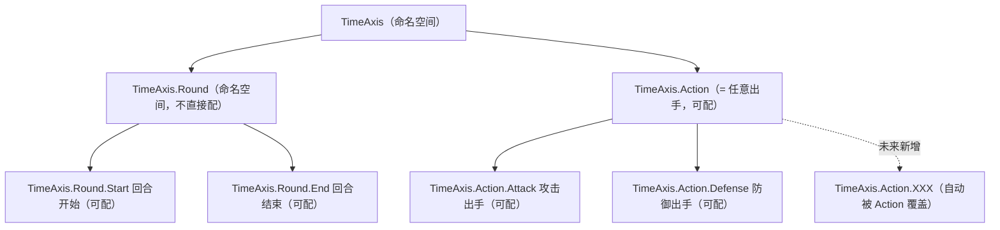
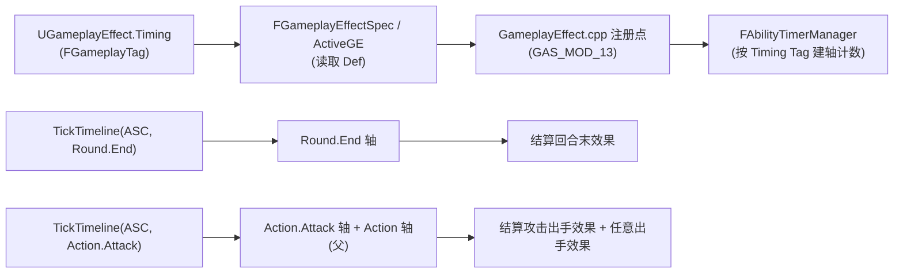

# GameplayAbilities 多时间轴（时机 Tag）改造方案

> 本文为**方案**（先定方案、后实施）。目标：把现有"单一回合刻度"的实现，升级为支持**多条时间轴 + 时机（Timing）细分**的通用模型。时机用 `FGameplayTag` 的**层级**表达，从而天然支持"任意出手包含未来新增类型"。
>
> - 前置方案：`回合制改造方案.md`（已实施，`GAS_MOD_05~09`）
> - 配套记录：`源码修改记录.md`
> - 引擎基线：UE 5.8
> - 状态：**待实施**（计划 `GAS_MOD_10~14`）

---

## 1. 背景与目标

### 1.1 问题

现有实现（`GAS_MOD_09`）只有一个匿名 `Turn` 计数（即"回合"刻度，对应下文 `TimeAxis.Round.*` 的单一来源；该字段名为既有实现，不再改动）：

```cpp
struct FAbilityTimerContainer
{
    int32 Turn = 0;                     // 1 代表什么由调用方决定
    TArray<FTimerHandle> TimerHandles;
};
```

- 无法区分"回合 / 出手次数"两种口径，同一 ASC 上的两类效果会**互相干扰**；
- 无法细分"回合开始 / 回合结束""攻击出手 / 防御出手"等**具体时机**；
- 无法表达"任意出手（含未来新增类型）"这类**聚合语义**。

### 1.2 目标

1. 引入**时机（Timing）**概念：回合开始/结束、攻击/防御出手等；
2. 用 `FGameplayTag` **层级**表达时机，父标签天然聚合子标签（"任意出手"自动含未来类型）；
3. 一个 ASC 可**同时维护多个时机的计数器**，各自独立推进；
4. GE 在资产上声明自己挂在**哪个时机**；
5. 回合类效果**每回合只结算一次**（不因开始/结束而重复）；
6. 对现有"只用回合"的用法**零影响**（默认时机 = `TimeAxis.Round.End`）；
7. 沿用 `GAS_MOD_xx` 标记规范，编号自 `GAS_MOD_10` 顺延。

---

## 2. 核心概念：时间轴 + 时机（Tag 层级）

**"回合"与"出手次数"是两条时间轴**；每条轴下又细分**时机**。用 Tag 层级统一表达：

> **命名取向**：`Round`（全体一轮）⊃ `Action`（单个单位的一次出手）。
> 即"一个回合"= 全体各出手一次，"出手"= 某单位的一次行动，二者层级不重叠。
> 不用 `Turn` 表示"回合"，因 `Turn` 在业界惯例中常指"**单个单位的一次行动**"，会与 `Action` 语义撞车。



**关键语义（已确认）：**

| 约定 | 说明 |
|------|------|
| `TimeAxis.Round` **不作 GE 可配值** | 配了会被 Start + End 各推一次 = 一回合 2 次，**违反"每回合一次"** |
| 回合类只配叶子 | `TimeAxis.Round.Start` 或 `TimeAxis.Round.End`，**各自每回合一次** |
| `TimeAxis.Action` **兼作"任意出手"** | 可配；`MatchesTag` 自动覆盖 `Action.Attack`/`Action.Defense` 及**未来新增**的 `Action.*` |

---

## 3. 设计决策

| 项 | 决策 |
|----|------|
| 时机标识形式 | **`FGameplayTag`**（层级天然支持聚合，替代枚举） |
| 配置位置 | **GE 上**（与 `DurationPolicy` 同层，作为 GE 的时间语义） |
| 计数器位置 | `FAbilityTimerManager`（每条已注册时机一个计数，单一数据源） |
| 推进方式 | `TickTimeline(ASC, 具体时机Tag, Delta)` → 推进**所有被匹配的轴（含父级）** |
| 实时制 | 由 `bTurnBased=false` 走原世界 `FTimerManager`（与本次 Scheme 正交） |

---

## 4. 数据结构设计

### 4.1 原生时机 Tag 声明（新增）

**位置**：`Public/GameplayEffectTypes.h`（或新建 `AbilityTimingTags.h`）

```cpp
// 声明原生 GameplayTag（Native Tags），集中管理时机标识
namespace AbilityTimingTags
{
    UE_DECLARE_GAMEPLAY_TAG_EXTERN(Round_Start);    // TimeAxis.Round.Start
    UE_DECLARE_GAMEPLAY_TAG_EXTERN(Round_End);      // TimeAxis.Round.End
    UE_DECLARE_GAMEPLAY_TAG_EXTERN(Action);        // TimeAxis.Action（任意出手）
    UE_DECLARE_GAMEPLAY_TAG_EXTERN(Action_Attack); // TimeAxis.Action.Attack
    UE_DECLARE_GAMEPLAY_TAG_EXTERN(Action_Defense);// TimeAxis.Action.Defense
}
```

```cpp
// .cpp 中注册
namespace AbilityTimingTags
{
    UE_DEFINE_GAMEPLAY_TAG_COMMENT(Round_Start,    "TimeAxis.Round.Start",     "回合开始");
    UE_DEFINE_GAMEPLAY_TAG_COMMENT(Round_End,      "TimeAxis.Round.End",       "回合结束");
    UE_DEFINE_GAMEPLAY_TAG_COMMENT(Action,        "TimeAxis.Action",         "任意出手");
    UE_DEFINE_GAMEPLAY_TAG_COMMENT(Action_Attack, "TimeAxis.Action.Attack",  "攻击出手");
    UE_DEFINE_GAMEPLAY_TAG_COMMENT(Action_Defense,"TimeAxis.Action.Defense", "防御出手");
}
```

> 也可将这些 tag 写入项目 `Config/DefaultGameplayTags.ini`，效果等同。

### 4.2 GE 上声明（新增字段）

**位置**：`Public/GameplayEffect.h`，`UGameplayEffect` 的 `DurationPolicy` 附近（当前 ~2255 行）

```cpp
/** Policy for the duration of this effect */
UPROPERTY(EditDefaultsOnly, Category=Duration)
EGameplayEffectDurationType DurationPolicy;

// [新增] 该 GE 的 Duration/Period 挂在哪个时机上（仅回合制模式下生效）
// 约束：回合类用 TimeAxis.Round.Start / TimeAxis.Round.End；出手类用 TimeAxis.Action 或 TimeAxis.Action.*
UPROPERTY(EditDefaultsOnly, Category=Duration, meta=(Categories="TimeAxis",
          EditCondition="DurationPolicy != EGameplayEffectDurationType::Instant", EditConditionHides))
FGameplayTag Timing = FGameplayTag::RequestGameplayTag(TEXT("TimeAxis.Round.End"));
```

### 4.3 `FAbilityTimerManager` 改为 Tag 版（扩展 `GAS_MOD_09`）

**文件**：`Public/AbilityTimerManager.h` + `Private/AbilityTimerManager.cpp`

```cpp
/** 某个"时机"的运行状态 */
struct FAbilityTimerAxis
{
    int32 Counter = 0;                    // 该时机的刻度
    TArray<FTimerHandle> TimerHandles;    // 挂在该时机上的 Timer
};

/** 某 ASC 的计时容器：按时机 Tag 分组 */
struct FAbilityTimerContainer
{
    TMap<FGameplayTag, FAbilityTimerAxis> Axes;   // key = 时机的 GameplayTag
};

class FAbilityTimerManager : public FTimerManager
{
public:
    FAbilityTimerManager() : FTimerManager(nullptr) {}

    /** 推进某 ASC 的指定时机（Delta 步进），命中所有匹配轴（含父级聚合） */
    void TickTimeline(UAbilitySystemComponent* ASC, FGameplayTag InTiming, int32 Delta = 1);

    /** 注册 Timer 到指定时机（Rate 语义为该时机刻度数） */
    void SetAbilityTimer(UAbilitySystemComponent* ASC, FGameplayTag InTiming,
                         FTimerHandle& OutHandle, const FTimerDelegate& InDelegate,
                         float InRate, bool bInLoop, float InFirstDelay = -1.f);

    /** 查询某 Timer 在指定时机上的剩余刻度 */
    float GetAbilityTimerRemaining(UAbilitySystemComponent* ASC, FGameplayTag InTiming, FTimerHandle& InHandle);

    /** 查询某 ASC 指定时机的当前刻度 */
    int32 GetTimelineCounter(UAbilitySystemComponent* ASC, FGameplayTag InTiming) const;

    /** 从指定时机移除 Timer */
    void RemoveAbilityTimer(UAbilitySystemComponent* ASC, FGameplayTag InTiming, FTimerHandle& InHandle);

private:
    TMap<TWeakObjectPtr<UAbilitySystemComponent>, FAbilityTimerContainer> AbilityTimerContainers;

    FAbilityTimerContainer& GetAbilityTimerContainer(UAbilitySystemComponent* ASC);
    FAbilityTimerAxis& GetAbilityTimerAxis(UAbilitySystemComponent* ASC, FGameplayTag InTiming);
};
```

### 4.4 `TickTimeline` 实现（推进所有匹配轴）

```cpp
void FAbilityTimerManager::TickTimeline(UAbilitySystemComponent* ASC, FGameplayTag InTiming, int32 Delta)
{
    if (!ASC || !InTiming.IsValid()) return;

    FAbilityTimerContainer& Container = GetAbilityTimerContainer(ASC);

    // 推进所有"被 InTiming 命中"的轴（InTiming 是已注册轴 AxisTag 的子/相等标签）：
    //   InTiming = Round.End      → 命中 Round.End
    //   InTiming = Action.Attack → 命中 Action.Attack、Action（任意出手）
    for (TPair<FGameplayTag, FAbilityTimerAxis>& Pair : Container.Axes)
    {
        const FGameplayTag AxisTag = Pair.Key;
        FAbilityTimerAxis& AxisData = Pair.Value;

        if (!InTiming.MatchesTag(AxisTag)) continue;   // 该轴与本次推进无关

        for (int32 Step = 0; Step < Delta; ++Step)
        {
            AxisData.Counter++;

            TArray<FTimerHandle> ToRemove;
            for (FTimerHandle& Handle : AxisData.TimerHandles)
            {
                FTimerData* Data = FindTimer(Handle);
                if (!Data) { ToRemove.Emplace(Handle); continue; }

                if (Data->ExpireTime <= static_cast<double>(AxisData.Counter))
                {
                    Data->TimerDelegate.Execute();
                    if (Data->bLoop)
                        Data->ExpireTime = static_cast<double>(AxisData.Counter) + static_cast<double>(Data->Rate);
                    else
                        ToRemove.Emplace(Handle);
                }
            }
            for (FTimerHandle& Handle : ToRemove)
            {
                RemoveAbilityTimer(ASC, AxisTag, Handle);
                ClearTimer(Handle);
            }
        }
    }
}
```

---

## 5. 数据流



---

## 6. 编号规划（`GAS_MOD_10~14`，Tag 版）

| 编号 | 文件 | 内容 |
|------|------|------|
| `GAS_MOD_10` | `GameplayEffectTypes.h`（或 `AbilityTimingTags.h`） | 声明原生时机 Tag（`TimeAxis.Round.Start/End`、`TimeAxis.Action`、`TimeAxis.Action.Attack/Defense`） |
| `GAS_MOD_11` | `GameplayEffect.h` | `UGameplayEffect` 新增 `FGameplayTag Timing` 字段 |
| `GAS_MOD_12` | `AbilityTimerManager.h/.cpp` | 扩展 `GAS_MOD_09`：`FAbilityTimerContainer` 改 `TMap<FGameplayTag, FAbilityTimerAxis>`；接口改 Tag 版；新增 `TickTimeline`；**移除旧 `TickTurn`** |
| `GAS_MOD_13` | `GameplayEffect.cpp` | `07a/07b/07d/07e` 注册点：`SetAbilityTimer(..., Spec.Def->Timing, ...)`；`07c/07h`、`07f/07g` 的查询/清理带 Timing |
| `GAS_MOD_14` | `AbilitySystemBlueprintLibrary.h/.cpp` | 蓝图入口由 `TickTurn`（`GAS_MOD_08`）替换为 `TickTimeline(ASC, FGameplayTag Timing, Delta = 1)` |

### 6.1 注册点改造（`GAS_MOD_13`，对应 `07a`）

```cpp
if (!Owner->IsTurnBased())
{
    FTimerManager& TimerManager = Owner->GetWorld()->GetTimerManager();
    TimerManager.SetTimer(AppliedActiveGE->DurationHandle, Delegate, FinalDuration, false);
}
else
{
    FAbilityTimerManager& AbilityTimerManager = UAbilitySystemGlobals::Get().GetAbilityTimerManager();
    const FGameplayTag Timing = AppliedActiveGE->Spec.Def->Timing;   // 从 GE 读取时机
    AbilityTimerManager.SetAbilityTimer(Owner, Timing, AppliedActiveGE->DurationHandle, Delegate, FinalDuration, false);
}
```

> `07b/07d/07e` 同理带 `Timing`；`07c/07h` 的 `GetAbilityTimerRemaining` 与 `07f/07g` 的 `RemoveAbilityTimer` 也需传入对应 `Timing`（清理时可遍历容器按句柄定位，或从 `ActiveGE` 记录其 Timing）。

### 6.2 蓝图入口（`GAS_MOD_14`）

```cpp
// AbilitySystemBlueprintLibrary.h
UFUNCTION(BlueprintCallable, Category = "Ability|Timeline")
static void TickTimeline(UAbilitySystemComponent* AbilitySystemComponent, FGameplayTag Timing, int32 Delta = 1);

// AbilitySystemBlueprintLibrary.cpp
void UAbilitySystemBlueprintLibrary::TickTimeline(UAbilitySystemComponent* AbilitySystemComponent, FGameplayTag Timing, int32 Delta)
{
    if (!AbilitySystemComponent) return;
    UAbilitySystemGlobals::Get().GetAbilityTimerManager().TickTimeline(AbilitySystemComponent, Timing, Delta);
}
```

---

## 7. 使用方式

### 7.1 GE 配置

| 需求 | GE 的 `Timing` | 结算频率 |
|------|---------------|---------|
| 持续 N 回合的 Buff/Debuff（回合末递减） | `TimeAxis.Round.End` | 每回合 1 次 |
| 回合开始时触发（回合初回血等） | `TimeAxis.Round.Start` | 每回合 1 次 |
| 每 N 次**任意**出手触发（含未来类型） | `TimeAxis.Action` | 每次出手 1 次 |
| 仅攻击出手后触发 | `TimeAxis.Action.Attack` | 仅攻击时 |
| 仅防御出手后触发 | `TimeAxis.Action.Defense` | 仅防御时 |

### 7.2 玩法侧推进

```cpp
// 回合开始
TickTimeline(ASC, AbilityTimingTags::Round_Start);
// 回合结束
TickTimeline(ASC, AbilityTimingTags::Round_End);
// 攻击出手后
TickTimeline(ASC, AbilityTimingTags::Action_Attack);
// 防御出手后
TickTimeline(ASC, AbilityTimingTags::Action_Defense);
```

**验证**：
- 配 `Round.End` 的 3 回合 Buff → 每次回合结束推 1 次，3 次到期 → 每回合一次 ✓
- 配 `Action` 的"每 2 次出手触发" → 攻击/防御出手都推 → 任意出手都算 ✓
- 未来新增 `Action.Move` → 配 `Action` 的效果自动被触发 → 含未来类型 ✓

---

## 8. 语义约定与保证

1. **每回合只一次**：回合类效果只配 `Round.Start` 或 `Round.End`（叶子），**禁止配** `TimeAxis.Round`。
   - 技术兜底：`SetAbilityTimer` 中若发现 `InTiming == TimeAxis.Round`（或为命名空间标签），可 `ensure`/`UE_LOG` 警告。
2. **任意出手含未来**：靠 `Action` 父标签 + `MatchesTag` 机制自动覆盖未来 `Action.*`。
3. **默认时机**：`Timing` 默认 `TimeAxis.Round.End`，未配置的 GE 行为与现状一致。

---

## 9. 兼容性与影响

- **默认时机 = `Round.End`**：现有 GE 行为与 `GAS_MOD_09` 一致（若不显式配 Timing）。
- **旧 `TickTurn` 移除**：`GAS_MOD_09` 的 `TickTurn`（蓝图 + 管理器接口）不再保留兼容封装，统一由 `TickTimeline(ASC, TimeAxis.Round.End)` 取代，既有调用点需相应迁移。
- **`bTurnBased` 定位不变**：仍是"该 ASC 是否启用时机驱动"。
- **与既有 `GAS_MOD_01~09`**：`GAS_MOD_10~14` 为新增/扩展；`GAS_MOD_12` 是对 `09` 文件的扩展性修改。

---

## 10. 分阶段实施步骤

1. **阶段一（基础，`GAS_MOD_10~12`）**：定义时机 Tag；GE 加 `Timing`；`FAbilityTimerManager` 改 Tag 版。
2. **阶段二（接线，`GAS_MOD_13~14`）**：注册点按 `Timing` 路由；新增蓝图 `TickTimeline`。
3. **阶段三（验证）**：实时制行为不变；回合类（Start/End）每回合一次；`Action` 任意出手含攻防。
4. **阶段四（可选）**：接入更多出手类型（如 `Action.Move`），验证"任意出手"自动覆盖。

---

## 11. 风险与注意事项

- **GE 结构改动**：`UGameplayEffect` 加 `FGameplayTag` 字段属核心结构改动，新字段带默认值，注意序列化/复制兼容。
- **调用点遗漏**：`SetAbilityTimer`/`RemoveAbilityTimer`/`GetAbilityTimerRemaining` 所有调用点都要传 `Timing`；建议签名去掉默认值，强制显式传参避免歧义。
- **清理一致性**：`RemoveAbilityTimer` 需知道句柄所属时机。方案：`FActiveGameplayEffect` 或其 Handle 记录 `Timing`，或移除时遍历所有轴按句柄查找。
- **父标签误配**：需靠约定 + 编辑器 `Categories` 限制 + 运行时警告，避免配 `TimeAxis.Round` 造成一回合两次。
- **推进时机由玩法保证**：`Round.Start/End`、`Action.Attack/Defense` 必须在正确时机调用（引擎不负责何时算"回合结束/出手"）。

---

## 12. 结论

本方案把 `GAS_MOD_09` 的"匿名单一刻度"升级为**时机 Tag 驱动的多时间轴模型**：

- **时机**用 `FGameplayTag` 层级表达（`TimeAxis.Round.Start/End`、`TimeAxis.Action[.Attack/.Defense]`）；
- **配置仍在 GE 上**（`FGameplayTag Timing`）；
- `TickTimeline(ASC, 具体时机Tag, Delta)` **推进所有匹配的轴（含父级聚合）**；
- **回合类每回合一次**（配叶子 Start/End），**任意出手含未来新增**（配父 Action）。
